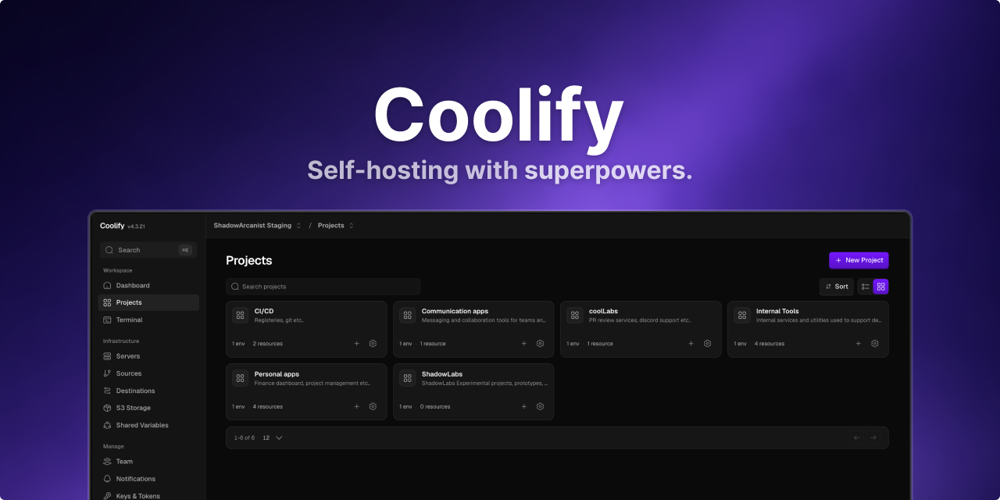

   

 

## What is Coolify?

Coolify is an open-source, self-hostable platform for deploying **any application, database, or service** on your own servers.

It gives you the experience of a managed cloud platform while running on infrastructure you control. This could be a VPS, a bare-metal server, a Raspberry Pi, or even an old laptop running Linux.

Coolify is fully free and open source, as described in our [philosophy](https://coolify.io/philosophy), with an optional managed service, Coolify Cloud. **Nothing is locked behind a paywall.**

 

## Screenshots

<table>
  <tr>
    <td align="left" colspan="2"><b>Dashboard: projects and servers at a glance</b></td>
  </tr>
  <tr>
    <td align="center">
      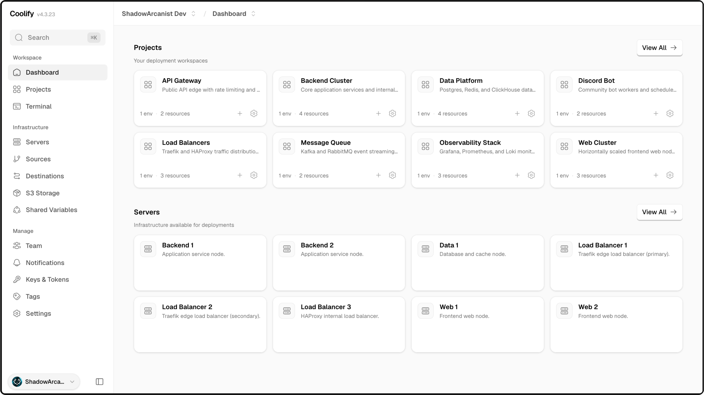
    </td>
    <td align="center">
      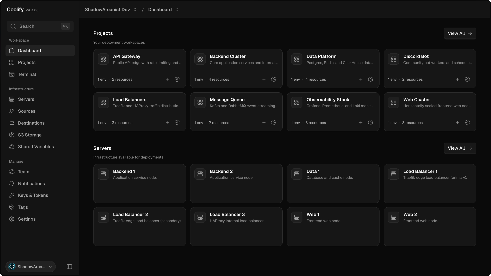
    </td>
  </tr>
  <tr>
    <td align="left" colspan="2"><b>Application configuration: deploy and configure any application</b></td>
  </tr>
  <tr>
    <td align="center">
      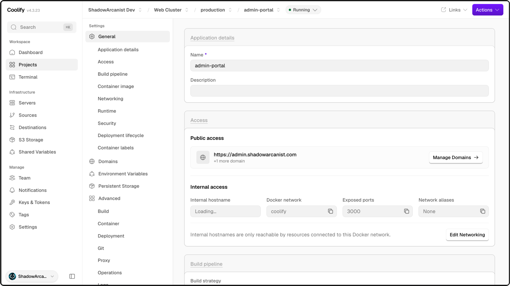
    </td>
    <td align="center">
      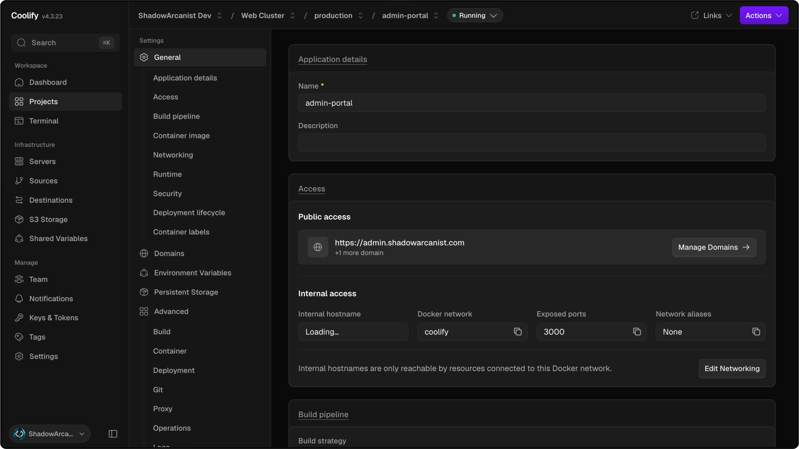
    </td>
  </tr>
  <tr>
    <td align="left" colspan="2"><b>Domains: custom domains with automatic HTTPS</b></td>
  </tr>
  <tr>
    <td align="center">
      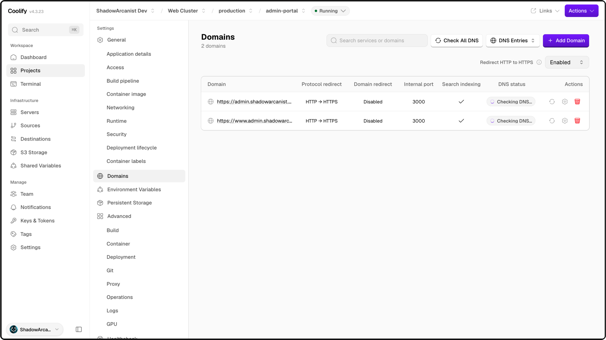
    </td>
    <td align="center">
      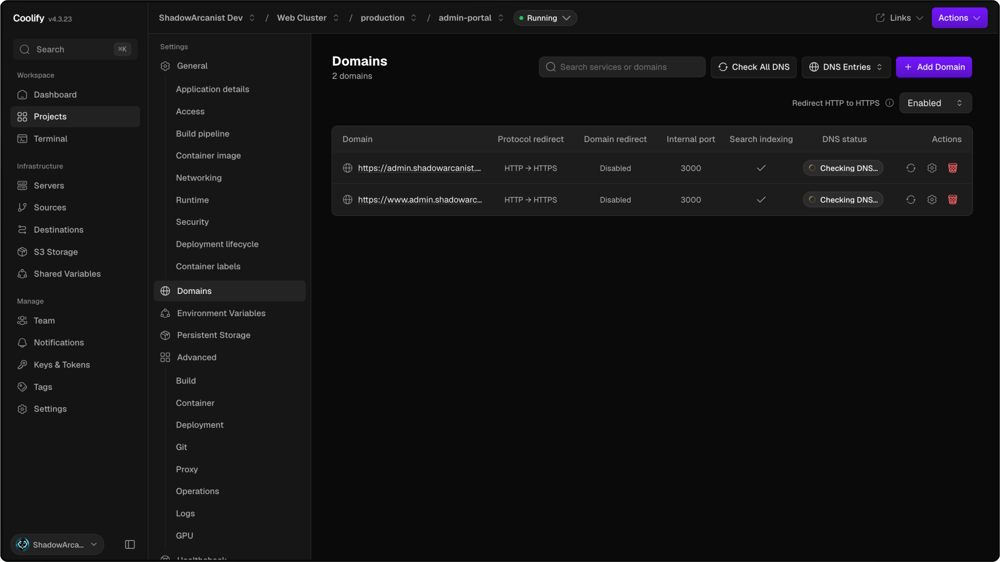
    </td>
  </tr>
  <tr>
    <td align="left" colspan="2"><b>Server metrics: real-time CPU and memory monitoring</b></td>
  </tr>
  <tr>
    <td align="center">
      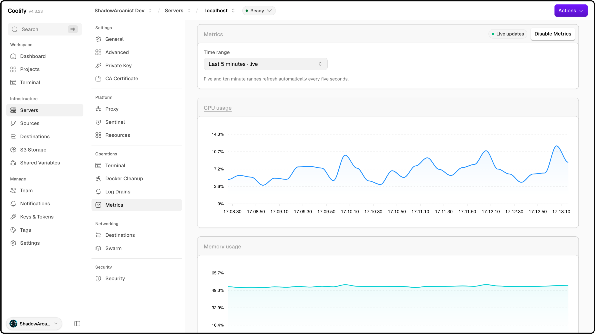
    </td>
    <td align="center">
      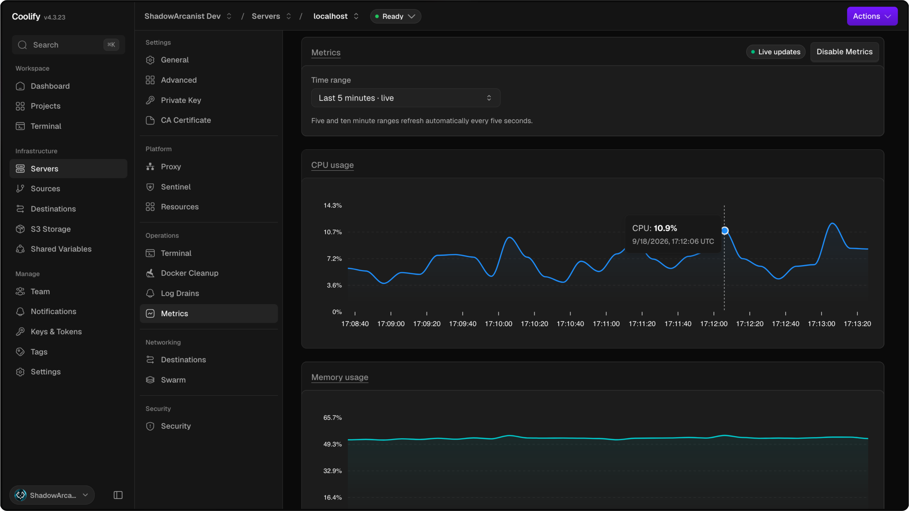
    </td>
  </tr>
  <tr>
    <td align="left" colspan="2"><b>Notifications: alerts via Discord, Telegram, Slack, and more</b></td>
  </tr>
  <tr>
    <td align="center">
      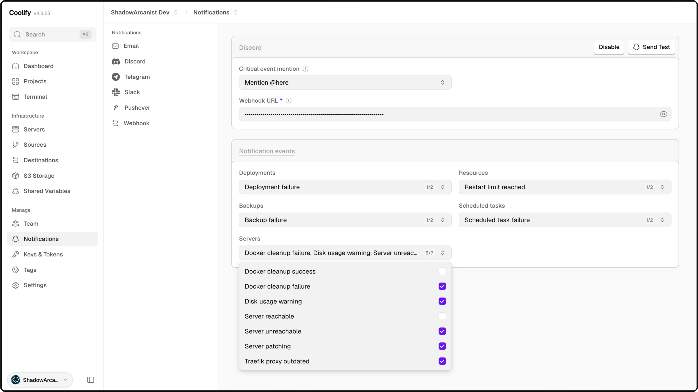
    </td>
    <td align="center">
      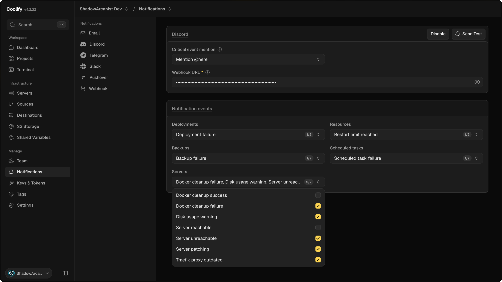
    </td>
  </tr>
</table>

 

## Key features

| Area | Highlights |
| :--- | :--- |
| **Deploy** | Any stack via Railpack, Dockerfile or Compose, with auto-deploy, PR previews, rolling updates & rollbacks |
| **Databases & services** | Deploy Postgres, MongoDB, Redis & more, plus 340+ one-click services |
| **Networking** | Reverse proxy with automatic HTTPS, custom domains & isolated Docker networks |
| **Servers** | Manage unlimited servers over SSH, or provision new ones from hosting providers |
| **Monitor** | Real-time metrics, logs, web terminal & health checks |
| **Security & teams** | Scheduled backups, secrets, teams, plus a REST API, CLI & MCP server |

This is just a highlight — there's much more.

 

## Get started

- [Choose your path](https://coolify.io/docs/choose-your-path) — self-host or use Coolify Cloud
- [Start with self-hosted](https://coolify.io/docs/start-with-self-hosted)
- [Start with Coolify Cloud](https://coolify.io/docs/start-with-cloud)
- [REST API](https://coolify.io/docs/api/overview)
- [CLI](https://coolify.io/docs/cli/what-is-the-coolify-cli)
- [MCP server](https://coolify.io/docs/mcp/what-is-mcp)

 

## Resources

- [Website](https://coolify.io)
- [Documentation](https://coolify.io/docs)
- [Discord community](https://coollabs.io/discord)
- [Discussions](https://github.com/coollabsio/coolify/discussions)
- [Support](https://coolify.io/docs/support)

 

## Donations

Coolify is free and open-source, with nothing locked behind a paywall, and we want to keep it that way. If Coolify is useful to you, please consider sponsoring to help fund its future development.

- [Sponsor Coolify](https://coolify.io/sponsorships)

Thank you for your support!

 

### Huge Sponsors

| Sponsor | Description |
| :--- | :--- |
| [CubePath](https://cubepath.com/coolify) | Premium dedicated servers and cloud VPS hosting |
| [Context.dev](https://www.context.dev/) | Web scraping API for AI agents |
| [Ginernet](https://ginernet.com/) | Hosting powerful servers in Spain |
| [SerpAPI](https://serpapi.com) | Google Search API — Scrape Google and other search engines from our fast, easy, and complete API. |
| [MVPS](https://www.mvps.net) | Cheap VPS servers at the highest possible quality |
| [ScreenshotOne](https://screenshotone.com) | Screenshot API for devs |
| [PrivateAlps](https://privatealps.net) | Cloud Services Provider, VPS, servers infrastructure for people who care about privacy and control |
| [Seibert Group](https://seibert.link/coolifysoftware) | Boost productivity company-wide with AI agents like Claude Code |
| [Contabo](https://contabo.com/en/coolify-vps/) | Cloud VPS & dedicated servers at unbeatable prices |

 

### Big Sponsors

| Sponsor | Description |
| :--- | :--- |
| [Vanaways](https://www.vanaways.co.uk) | New vans for sale and lease across the UK |
| [Cloudways](https://www.cloudways.com/en/?id=2125302) | Managed cloud hosting platform by DigitalOcean |
| [ByteBase](https://www.bytebase.com) | Database CI/CD and Security at Scale |
| [Ramnode](https://ramnode.com/) | High Performance Cloud VPS Hosting |
| [23M](https://23m.com) | Your experts for high-availability hosting solutions! |
| [Macarne](https://macarne.com) | Best IP Transit & Carrier Ethernet Solutions for Simplified Network Connectivity |
| [Hetzner](http://htznr.li/CoolifyXHetzner) | Server, cloud, hosting, and data center solutions |
| [Logto](https://logto.io) | The better identity infrastructure for developers |
| [Supadata](https://supadata.ai/) | Scrape YouTube, web, and files. Get AI-ready, clean data for your next project. |
| [Tolgee](https://tolgee.io) | The open source localization platform |
| [Best Consultant](https://bc.direct) | Your trusted technology consulting partner |
| [ArcJet](https://arcjet.com) | Advanced web security and performance solutions |
| [SupaGuide](https://supa.guide) | Your comprehensive guide to Supabase |
| [CodeRabbit](https://coderabbit.ai) | Cut Code Review Time & Bugs in Half |
| [Convex](https://convex.link/coolify.io) | Convex is the open-source reactive database for web app developers. |
| [GoldenVM](https://billing.goldenvm.com) | Premium virtual machine hosting solutions |
| [Comit International](https://comit.international) | New York Times award–winning contractor! |
| [Compai](https://www.trycomp.ai) | The open source compliance automation platform that does everything you need to get compliant, fast. Open source alternative to Drata & Vanta. |
| [Tigris](https://www.tigrisdata.com) | Modern S3 Alternative |
| [Blacksmith](https://blacksmith.sh) | Infrastructure automation platform |
| [JobsCollider](https://jobscollider.com/remote-jobs) | 30,000+ remote jobs for developers |
| [Darweb](https://darweb.nl/?ref=coolify.io&utm_source=coolify.io) | Design. Develop. Deliver. Specialized in 3D CPQ Solutions for eCommerce. |
| [Hostinger](https://www.hostinger.com/vps/coolify-hosting) | Web hosting and VPS solutions |
| [Mobb](https://vibe.mobb.ai/) | Secure Your AI-Generated Code to Unlock Dev Productivity |
| [Ubicloud](https://www.ubicloud.com) | Open source cloud infrastructure platform |
| [PFGLabs](https://pfglabs.com) | Build Real Projects with Golang |
| [JuxtDigital](https://juxtdigital.com) | Digital PR & AI Authority Building Agency |
| [SaasyKit](https://saasykit.com) | Complete SaaS starter kit for developers |
| [American Cloud](https://americancloud.com) | US-based cloud infrastructure services |
| [Greptile](https://www.greptile.com) | The AI Code Reviewer |
| [VPSDime](https://vpsdime.com/) | Cheap VPS Hosting - 4GB for $5/month |
| [dataforest Cloud](https://cloud.dataforest.net/en) | Deploy cloud servers as seeds independently in seconds. Enterprise hardware, premium network, 100% made in Germany. |
| [ISHosting](https://ishosting.com/) | Hosting and VPS solutions |
| [PetroSky Cloud](https://petrosky.io) | Open source cloud deployment solutions |
| [QuickSrv](https://quicksrv.io/) | Fast and reliable server hosting |

 

### Small Sponsors

...and many more at [GitHub Sponsors](https://github.com/sponsors/coollabsio)

 

## Star History

  

