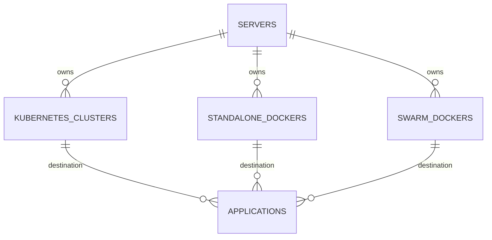
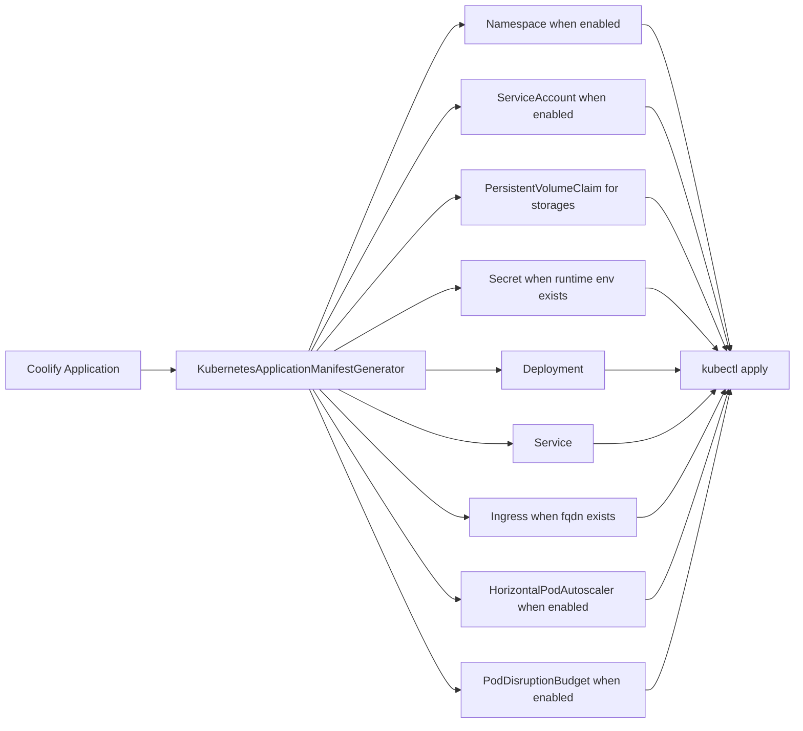
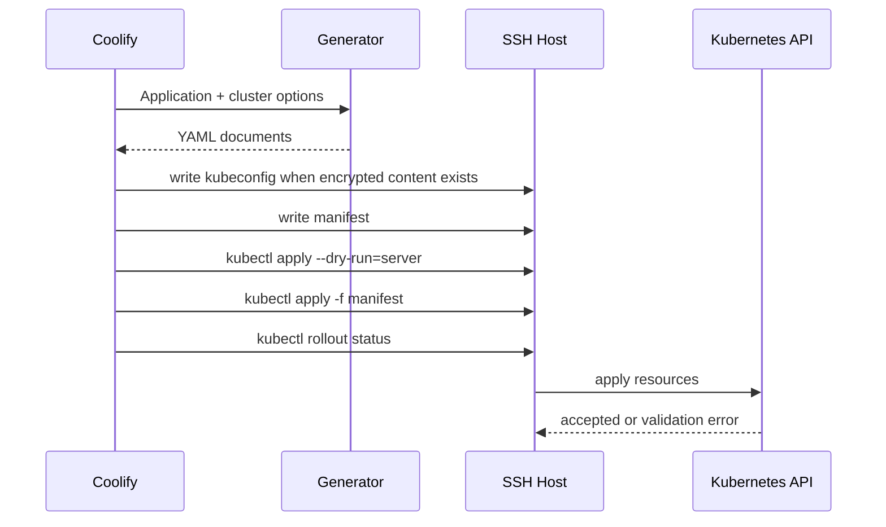
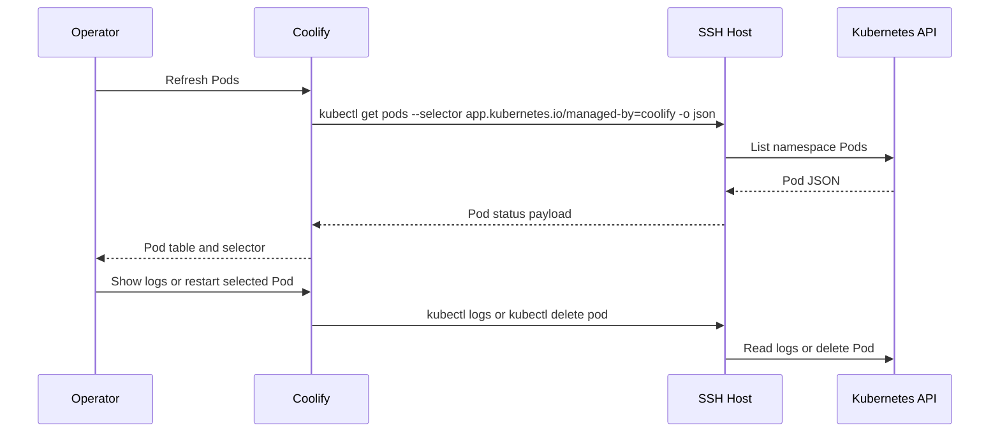

# Kubernetes Destination Deployment

## Summary

Coolify now has a Kubernetes destination path that mirrors the existing `StandaloneDocker` and `SwarmDocker` polymorphic destination shape, exposes UI for cluster configuration, and deploys application manifests with `kubectl`.

This foundation targets the deploy-to-Kubernetes path from [coollabsio/coolify#2390](https://github.com/coollabsio/coolify/issues/2390). It does not solve running Coolify itself inside Kubernetes, which remains a separate Helm/GitOps concern tracked in [discussion #2455](https://github.com/coollabsio/coolify/discussions/2455).

## Goals

- Add a first-class `KubernetesCluster` destination model.
- Generate Kubernetes-native manifests from a Coolify application image configuration.
- Generate Kubernetes-native manifests for image-based Docker Compose applications.
- Support production SaaS primitives: Namespace, ServiceAccount, Deployment, Service, Ingress, Secret-backed runtime env, PersistentVolumeClaim, PodDisruptionBudget, probes, resource limits, rolling updates, and optional HorizontalPodAutoscaler.
- Keep deployment execution explicit through generated `kubectl` commands over the existing SSH execution host.
- Validate generated manifests with unit tests, `kubectl --dry-run=client`, and server-side dry-run in the deployment job.

## Non-Goals

- No automatic K3s installation flow.
- No Docker Compose services that require local `build` steps on the destination. Compose services must reference pullable images for Kubernetes destinations.
- No database or service template translation.
- No Helm chart for running Coolify itself inside Kubernetes.

## Research Inputs

- [Full Kubernetes support with autoscale](https://github.com/coollabsio/coolify/issues/2390) is the canonical feature request. The most concrete community PoC uses a `KubernetesCluster` model, manifest generation, and `kubectl apply`.
- [Kubernetes Helm Chart for GitOps Deployments](https://github.com/coollabsio/coolify/discussions/2455) asks for Coolify itself to run in Kubernetes. A maintainer/contributor comment notes that Coolify's Docker dependency makes this a different, harder problem.
- [Coolify v5.x](https://github.com/coollabsio/coolify/issues/5685) frames scaling as core product work, with discussion around simple production scalability.
- Kubernetes docs used for API targets: [Deployments](https://kubernetes.io/docs/concepts/workloads/controllers/deployment/), [Pods](https://kubernetes.io/docs/concepts/workloads/pods/), [Services](https://kubernetes.io/docs/concepts/services-networking/service/), [Ingress](https://kubernetes.io/docs/concepts/services-networking/ingress/), [Horizontal Pod Autoscaling](https://kubernetes.io/docs/concepts/workloads/autoscaling/horizontal-pod-autoscale/), [ServiceAccounts](https://kubernetes.io/docs/concepts/security/service-accounts/), [Storage Classes](https://kubernetes.io/docs/concepts/storage/storage-classes/), [Pod Disruption Budgets](https://kubernetes.io/docs/concepts/workloads/pods/disruptions/), and [kubeconfig](https://kubernetes.io/docs/concepts/configuration/organize-cluster-access-kubeconfig/).

## Data Model

`kubernetes_clusters` stores connection metadata for a Kubernetes destination owned through a Coolify `Server`.

| Field                                 | Purpose                                                              |
| ------------------------------------- | -------------------------------------------------------------------- |
| `server_id`                           | Keeps current team ownership and SSH execution boundaries.           |
| `name`                                | Human-readable destination name.                                     |
| `namespace`                           | Default namespace for generated resources.                           |
| `create_namespace`                    | Adds a Namespace manifest when the destination owns namespace setup. |
| `context`                             | Optional kubeconfig context.                                         |
| `kubeconfig_path`                     | Optional path on the execution host.                                 |
| `kubeconfig`                          | Optional encrypted kubeconfig content written to the execution host. |
| `ingress_class`                       | Default Ingress class, initially `traefik`.                          |
| `ingress_tls_secret`                  | Optional TLS secret reference for generated Ingress resources.       |
| `ingress_annotations`                 | Optional key/value annotations for ingress controllers and certs.    |
| `service_type`                        | Default Service type, initially `ClusterIP`.                         |
| `service_account_name`                | Optional ServiceAccount name mounted into application Pods.          |
| `create_service_account`              | Adds a ServiceAccount manifest when enabled.                         |
| `image_pull_secrets`                  | Newline/comma separated image pull secret references.                |
| `storage_class` / `storage_size`      | PVC defaults for Coolify persistent storage mappings.                |
| `replicas`                            | Deployment replica count.                                            |
| `autoscaling_enabled`                 | Enables an HPA manifest.                                             |
| `min_replicas` / `max_replicas`       | HPA scaling bounds.                                                  |
| `target_cpu_utilization_percentage`   | HPA CPU target.                                                      |
| `node_selector` / `tolerations`       | Optional Pod placement controls.                                     |
| `pod_disruption_budget_enabled`       | Enables a PDB manifest.                                              |
| `pod_disruption_budget_min_available` | PDB minimum availability as an integer or percent.                   |



The diagram shows the destination parity goal: Kubernetes clusters sit beside existing Docker destinations and use the same polymorphic application destination pattern.

## Manifest Flow



The generator converts a Coolify application into Kubernetes resources. Docker Image applications use the configured image directly. Git, Dockerfile, Nixpacks, Railpack, and static builds must have a registry image name so the built image can be pushed before Kubernetes pulls it.

Image-based Docker Compose applications use `KubernetesComposeManifestGenerator`. Each Compose service becomes a Deployment and Service. Services with configured Compose domains also receive Ingress resources. Named volumes become PVCs. Bind mounts and services with `build` are rejected because they are not portable Kubernetes runtime definitions.

## Deployment Semantics

The first supported workload shape is stateless web application deployment:

- `Secret` uses `v1` and stores runtime environment variables for `envFrom`.
- `Namespace` and `ServiceAccount` are optional because some production clusters grant namespace-scoped credentials without namespace creation rights.
- `Deployment` uses `apps/v1`, `revisionHistoryLimit: 3`, rolling-update strategy, stable Coolify labels, image name/tag, exposed container port, HTTP probes, image pull secret refs, node placement, tolerations, PVC mounts, and resource settings.
- `Service` uses `v1`, defaults to `ClusterIP`, and routes public port `80` to the application container port.
- `Ingress` uses `networking.k8s.io/v1` and is emitted only when `fqdn` exists. TLS secret refs and annotations remain destination-configurable.
- `HorizontalPodAutoscaler` uses `autoscaling/v2` and is opt-in through destination UI.
- `PersistentVolumeClaim` uses `v1` and maps Coolify application persistent storage entries to `ReadWriteOnce` claims.
- `PodDisruptionBudget` uses `policy/v1` and is opt-in through destination UI.
- Stop scales the Deployment to `0`. Restart runs `kubectl rollout restart` for restart-only deployments.
- The destination page lists Coolify-managed Pods in the namespace, lets operators select a Pod/container, tails logs, and restarts a selected Pod by deleting it so the owning controller creates a replacement.
- Manual application status refresh reads the generated Deployment and its Coolify-managed Pods, then maps availability and Pod health back to Coolify statuses such as `running:healthy`, `starting:unhealthy`, `degraded:unhealthy`, or `exited`.
- Docker Compose deployments are supported when every service has a pullable `image`. Coolify rejects Compose services with `build` or bind mounts for Kubernetes destinations instead of applying partial or non-portable resources.



The diagram shows the intended execution path. This keeps Coolify's current SSH execution model intact while introducing Kubernetes as the backend API.

## Pod Operations



The diagram shows the destination operations loop. Coolify limits the default listing to resources labeled as managed by Coolify, keeps kubeconfig handling on the execution host, and uses Kubernetes controllers for replacement Pods after a restart action.

## Operational Notes

- Server-side dry-run is the production deployment validation before apply.
- Pod listing is an operator inspection path. Status refresh still allows Kubernetes eventual consistency by using Deployment availability and Pod states instead of assuming a newly applied resource is immediately healthy.
- Ingress must stay controller-agnostic. `ingress_class` should default to Traefik for Coolify parity but remain configurable.
- Database and service template support should be separate follow-up work. Static Compose conversion alone is not enough for stateful services because backups, credentials, lifecycle hooks, and status all need Coolify semantics.

## Test Plan

- Unit tests assert Namespace, ServiceAccount, Secret, Deployment, Service, Ingress, HPA, PVC, PDB, probes, resources, placement controls, host parsing, image overrides, image requirements, and image-based Compose translation.
- Unit tests assert escaped `kubectl` command construction, manifest writes, kubeconfig writes, rollout commands, Pod list/log/restart commands, Pod JSON parsing, and Kubernetes status mapping.
- Manifest YAML is parsed and checked with `kubectl apply --dry-run=client --validate=false`.
- Manual cluster validation should use:

```bash
kubectl --kubeconfig <path-to-kubeconfig> version --output=yaml
kubectl --kubeconfig <path-to-kubeconfig> apply --dry-run=server -f <manifest>
```

## Follow-Up Work

- Add status reconciliation from Service, Ingress, PVC, HPA, PDB, and ingress address state.
- Add StatefulSet generation before enabling stateful service/database templates.
- Add Kubernetes build/push support for Compose services that use `build`.
- Decide whether K3s bootstrap belongs in core or as a separate installation action.
