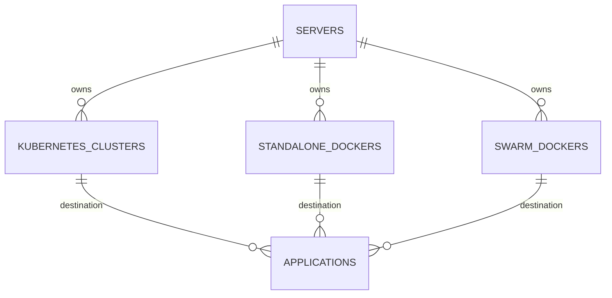
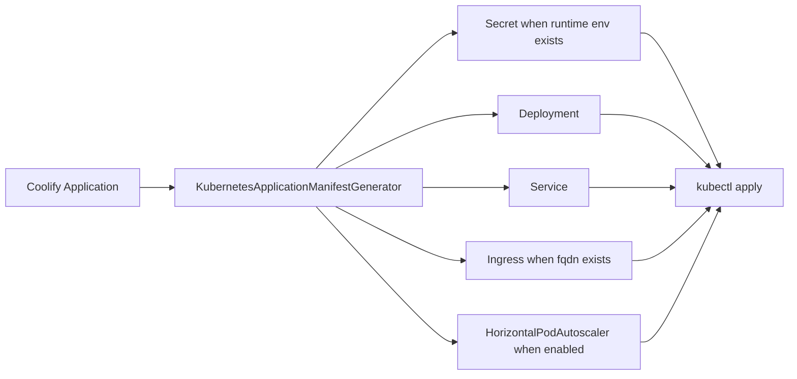
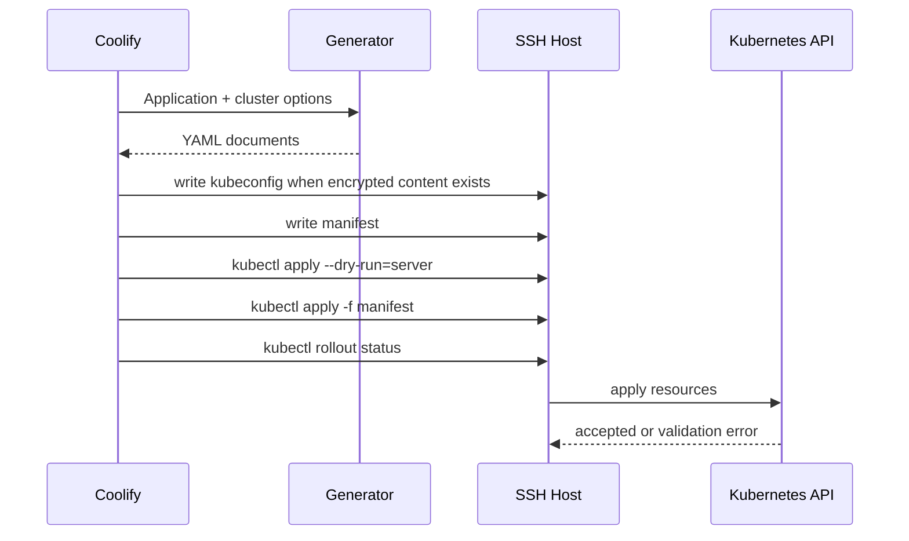

# Kubernetes Destination Deployment

## Summary

Coolify now has a Kubernetes destination path that mirrors the existing `StandaloneDocker` and `SwarmDocker` polymorphic destination shape, exposes UI for cluster configuration, and deploys application manifests with `kubectl`.

This foundation targets the deploy-to-Kubernetes path from [coollabsio/coolify#2390](https://github.com/coollabsio/coolify/issues/2390). It does not solve running Coolify itself inside Kubernetes, which remains a separate Helm/GitOps concern tracked in [discussion #2455](https://github.com/coollabsio/coolify/discussions/2455).

## Goals

- Add a first-class `KubernetesCluster` destination model.
- Generate Kubernetes-native manifests from a Coolify application image configuration.
- Support production SaaS primitives: Deployment, Service, Ingress, Secret-backed runtime env, probes, resource limits, rolling updates, and optional HorizontalPodAutoscaler.
- Keep deployment execution explicit through generated `kubectl` commands over the existing SSH execution host.
- Validate generated manifests with unit tests, `kubectl --dry-run=client`, and server-side dry-run in the deployment job.

## Non-Goals

- No automatic K3s installation flow.
- No Docker Compose to Kubernetes conversion.
- No database, service template, or persistent volume translation.
- No Helm chart for running Coolify itself inside Kubernetes.

## Research Inputs

- [Full Kubernetes support with autoscale](https://github.com/coollabsio/coolify/issues/2390) is the canonical feature request. The most concrete community PoC uses a `KubernetesCluster` model, manifest generation, and `kubectl apply`.
- [Kubernetes Helm Chart for GitOps Deployments](https://github.com/coollabsio/coolify/discussions/2455) asks for Coolify itself to run in Kubernetes. A maintainer/contributor comment notes that Coolify's Docker dependency makes this a different, harder problem.
- [Coolify v5.x](https://github.com/coollabsio/coolify/issues/5685) frames scaling as core product work, with discussion around simple production scalability.
- Kubernetes docs used for API targets: [Deployments](https://kubernetes.io/docs/concepts/workloads/controllers/deployment/), [Services](https://kubernetes.io/docs/concepts/services-networking/service/), [Ingress](https://kubernetes.io/docs/concepts/services-networking/ingress/), [Horizontal Pod Autoscaling](https://kubernetes.io/docs/concepts/workloads/autoscaling/horizontal-pod-autoscale/), and [kubeconfig](https://kubernetes.io/docs/concepts/configuration/organize-cluster-access-kubeconfig/).

## Data Model

`kubernetes_clusters` stores connection metadata for a Kubernetes destination owned through a Coolify `Server`.

| Field                               | Purpose                                                              |
| ----------------------------------- | -------------------------------------------------------------------- |
| `server_id`                         | Keeps current team ownership and SSH execution boundaries.           |
| `name`                              | Human-readable destination name.                                     |
| `namespace`                         | Default namespace for generated resources.                           |
| `context`                           | Optional kubeconfig context.                                         |
| `kubeconfig_path`                   | Optional path on the execution host.                                 |
| `kubeconfig`                        | Optional encrypted kubeconfig content written to the execution host. |
| `ingress_class`                     | Default Ingress class, initially `traefik`.                          |
| `service_type`                      | Default Service type, initially `ClusterIP`.                         |
| `replicas`                          | Deployment replica count.                                            |
| `autoscaling_enabled`               | Enables an HPA manifest.                                             |
| `min_replicas` / `max_replicas`     | HPA scaling bounds.                                                  |
| `target_cpu_utilization_percentage` | HPA CPU target.                                                      |



The diagram shows the destination parity goal: Kubernetes clusters sit beside existing Docker destinations and use the same polymorphic application destination pattern.

## Manifest Flow



The generator converts a Coolify application into Kubernetes resources. Docker Image applications use the configured image directly. Git, Dockerfile, Nixpacks, Railpack, and static builds must have a registry image name so the built image can be pushed before Kubernetes pulls it.

## Deployment Semantics

The first supported workload shape is stateless web application deployment:

- `Secret` uses `v1` and stores runtime environment variables for `envFrom`.
- `Deployment` uses `apps/v1`, `revisionHistoryLimit: 3`, rolling-update strategy, stable Coolify labels, image name/tag, exposed container port, HTTP probes, and resource settings.
- `Service` uses `v1`, defaults to `ClusterIP`, and routes public port `80` to the application container port.
- `Ingress` uses `networking.k8s.io/v1` and is emitted only when `fqdn` exists.
- `HorizontalPodAutoscaler` uses `autoscaling/v2` and is opt-in through destination UI.
- Stop scales the Deployment to `0`. Restart runs `kubectl rollout restart` for restart-only deployments.



The diagram shows the intended execution path. This keeps Coolify's current SSH execution model intact while introducing Kubernetes as the backend API.

## Operational Notes

- Server-side dry-run is the production deployment validation before apply.
- Status reconciliation must allow Kubernetes eventual consistency. The community PoC reported a false-failure race and solved it with a grace window.
- Ingress must stay controller-agnostic. `ingress_class` should default to Traefik for Coolify parity but remain configurable.
- Compose/service/database support should be separate follow-up work. Static Compose conversion alone is not enough for production because volumes, secrets, health checks, lifecycle hooks, and status all need Coolify semantics.

## Test Plan

- Unit tests assert Secret, Deployment, Service, Ingress, HPA, probes, resources, host parsing, image overrides, and image requirements.
- Unit tests assert escaped `kubectl` command construction, manifest writes, kubeconfig writes, and rollout commands.
- Manifest YAML is parsed and checked with `kubectl apply --dry-run=client --validate=false`.
- Manual cluster validation should use:

```bash
kubectl --kubeconfig <path-to-kubeconfig> version --output=yaml
kubectl --kubeconfig <path-to-kubeconfig> apply --dry-run=server -f <manifest>
```

## Follow-Up Work

- Add status reconciliation from Deployment, ReplicaSet, Pod, Service, and Ingress state.
- Add persistent volume support before enabling stateful service templates.
- Decide whether K3s bootstrap belongs in core or as a separate installation action.
