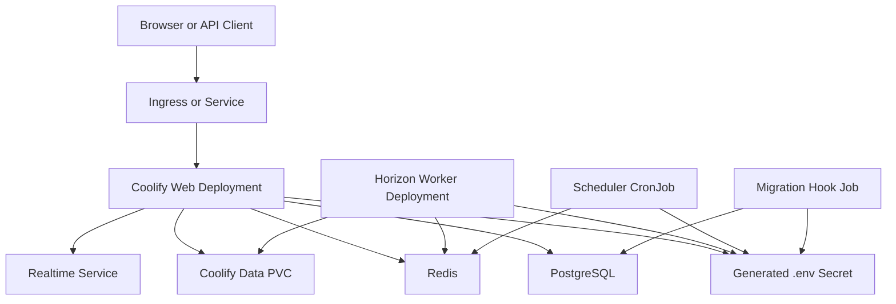
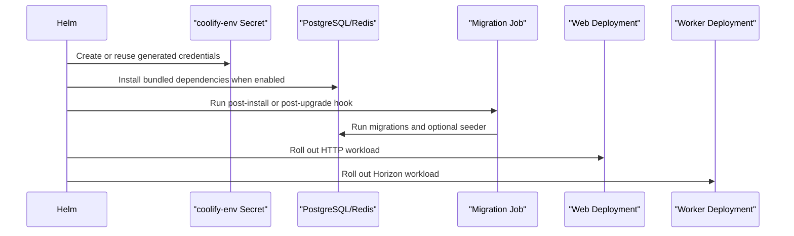

# Coolify Helm Chart

## Context

Coolify needs a first-party Kubernetes installation path for running Coolify itself, separate from Kubernetes destinations used to deploy customer applications. The scope aligns with the open full Kubernetes support discussion in [issue #2390](https://github.com/coollabsio/coolify/issues/2390), the Helm-specific discussion in [discussion #2455](https://github.com/coollabsio/coolify/discussions/2455), and the existing Docker Compose production topology.

## Goals

- Install Coolify as Kubernetes-native resources using Helm.
- Preserve the production image contract by mounting a generated `.env` file at `/var/www/html/.env`.
- Split web, queue, scheduler, migration, and realtime concerns into separate Kubernetes workloads.
- Support bundled PostgreSQL and Redis for quick installs, while making external PostgreSQL and Redis the production path.
- Support Kubernetes primitives operators expect: Ingress, PVC, RBAC, HPA, PDB, NetworkPolicy, probes, node placement, image pull secrets, and Helm tests.

## Non-Goals

- No Docker socket mount by default.
- No automatic migration from Docker Compose installations.
- No replacement for the Kubernetes destination feature that deploys user applications.

## Architecture

The chart installs the Coolify app image as web and worker workloads, the realtime image as a websocket service, and runs migrations through a Helm hook Job.

The diagram shows the runtime resource graph. Web serves HTTP, workers process queued jobs, the scheduler executes Laravel scheduled tasks, and migrations run before the release is considered ready.

## Install Lifecycle

The sequence keeps schema changes isolated in a Job. Runtime pods set `MIGRATION_ENABLED=false`, `HORIZON_ENABLED=false`, and `SCHEDULER_ENABLED=false` in the mounted `.env` file so the web container does not duplicate worker or scheduler responsibilities.

## Configuration Model

The chart generates `coolify-env` by default. That Secret contains individual keys for Kubernetes Secret references and a complete `.env` file for the Coolify image. Bundled PostgreSQL and Redis read the same Secret keys, so first install credentials match without manual password coordination.

External services are configured by disabling dependencies:

- `postgresql.enabled=false`
- `redis.enabled=false`
- `database.host`, `database.username`, `database.name`, `database.existingSecret`
- `redisConnection.host`, `redisConnection.existingSecret`

## Production Notes

- Use external PostgreSQL and Redis for HA, managed backups, point-in-time recovery, and predictable upgrades.
- Keep `app.autoUpdate=false`; Kubernetes upgrades should be driven by Helm values and image tags.
- Enable `podDisruptionBudget` and `autoscaling` only after resource requests are set.
- Use namespace-scoped RBAC by default. Set `rbac.clusterScoped=true` only for in-cluster management workflows that need cluster-wide access.
- Set `env.existingSecret` when credentials are owned by an external secret manager.

## References

- [Helm chart best practices](https://helm.sh/docs/chart_best_practices/)
- [Helm chart hooks](https://helm.sh/docs/topics/charts_hooks/)
- [Kubernetes CronJob](https://kubernetes.io/docs/concepts/workloads/controllers/cron-jobs/)
- [Kubernetes Persistent Volumes](https://kubernetes.io/docs/concepts/storage/persistent-volumes/)
- [Kubernetes PodDisruptionBudget](https://kubernetes.io/docs/tasks/run-application/configure-pdb/)
- [Bitnami PostgreSQL chart](https://artifacthub.io/packages/helm/bitnami/postgresql)
- [Bitnami Redis chart](https://artifacthub.io/packages/helm/bitnami/redis)
