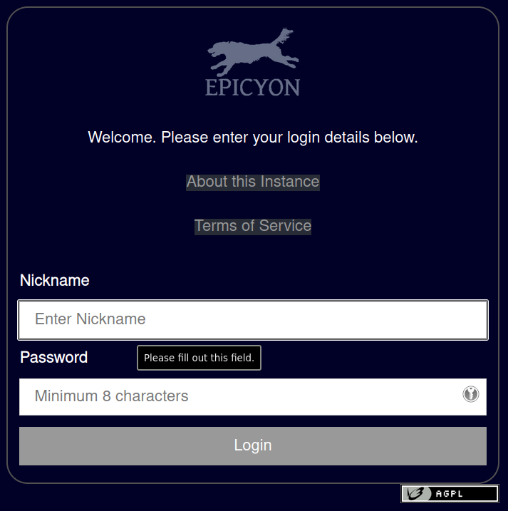
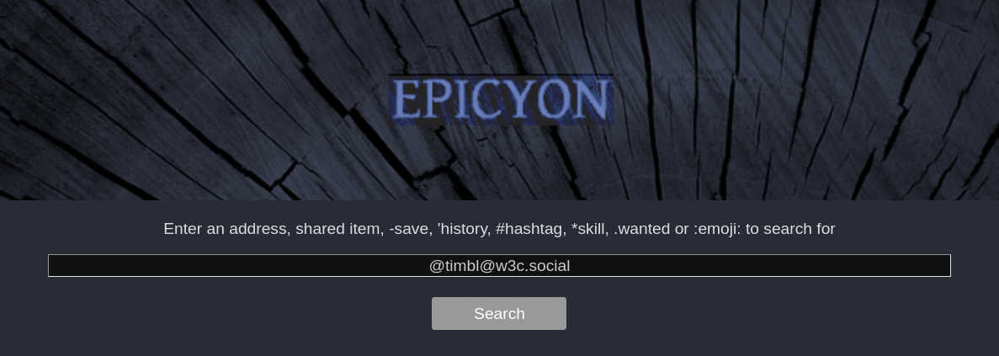
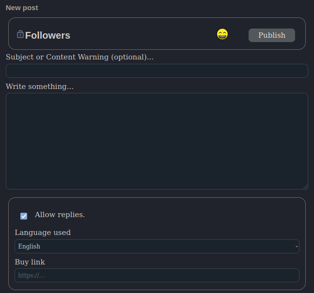
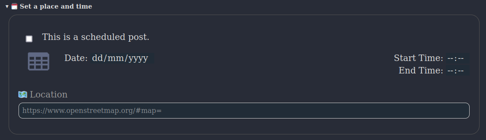
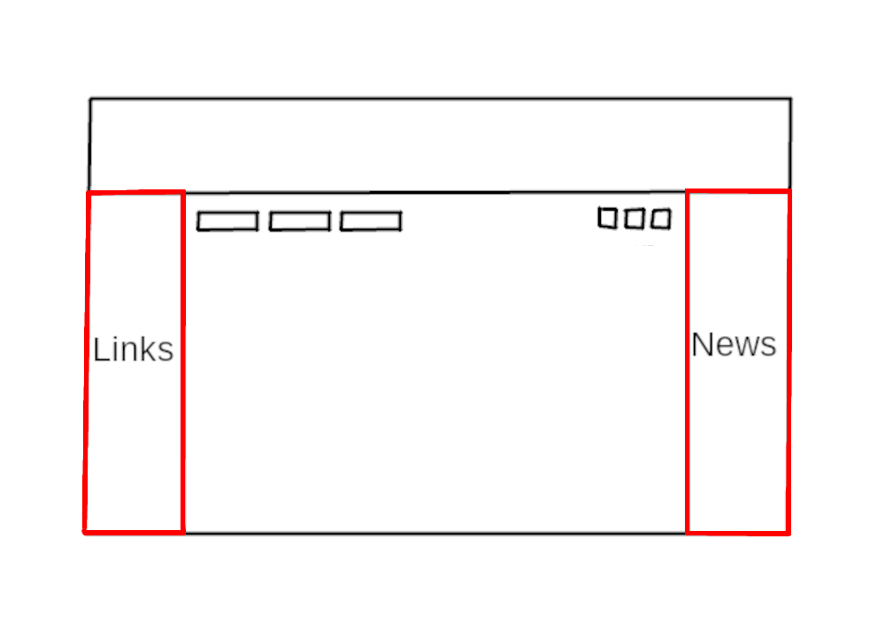
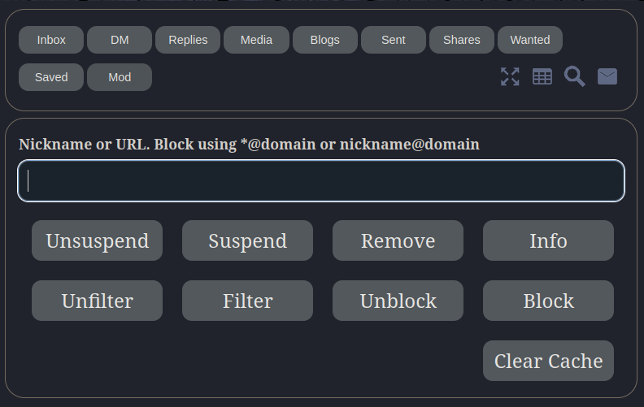
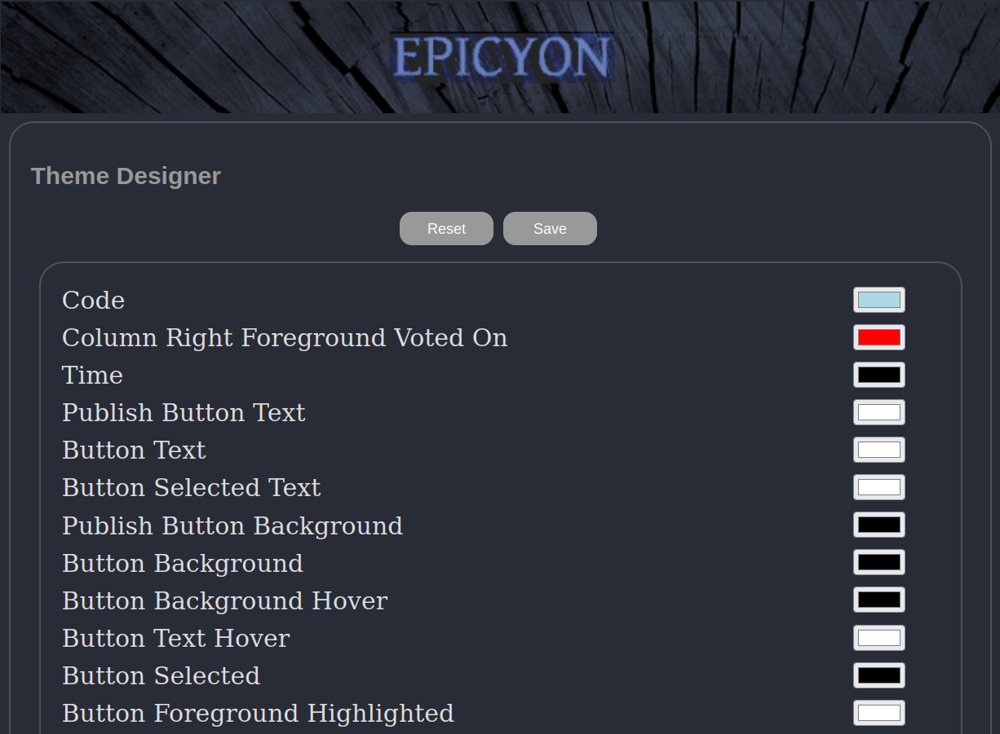
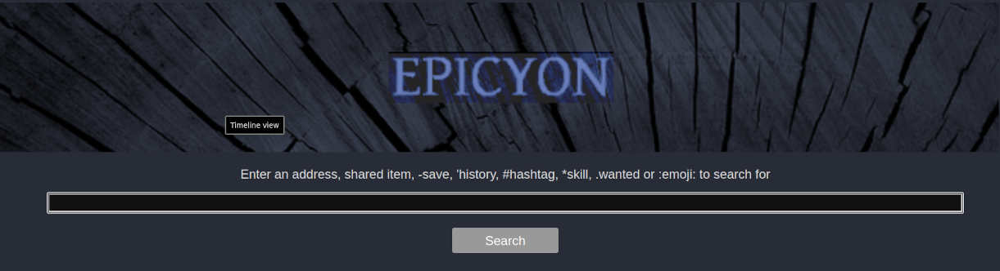

# Table of Contents
1. [Introduction](#introduction)
2. [Installation](#installation)
3. [Upgrading](#upgrading)
4. [Housekeeping](#housekeeping)
5. [Registering accounts](#registering-accounts)
6. [The importance of good defaults](#the-importance-of-good-defaults)
7. [Logging in](#logging-in)
8. [Account Profiles](#account-profiles)
9. [Following](#following)
10. [Creating posts](#creating-posts)
11. [The Timeline](#the-timeline)
12. [Calendar](#calendar)
13. [Side columns](#side-columns)
14. [Media timeline](#media-timeline)
15. [Moderation](#moderation)
16. [Themes](#themes)
17. [Buying and selling](#buying-and-selling)
18. [Sharing economy](#sharing-economy)
19. [Search](#search)
20. [Browsing in a command shell](#browsing-in-a-command-shell)
21. [Building fediverse communities](#building-fediverse-communities)
22. [A Brief History of the Fediverse](#a-brief-history-of-the-fediverse)

# Introduction
*"Every new beginning comes from some other beginning’s end."*

-- Seneca

*The fediverse* is a set of federated servers, typically using a communication protocol called [ActivityPub](https://www.w3.org/TR/activitypub) which was devised by the [social working group](https://www.w3.org/wiki/Socialwg) within the World Wide Web Consortium (W3C). At present it is mostly used for [microblogging](https://en.wikipedia.org/wiki/Microblogging), although ActivityPub is sufficiently general that it can also be used for a variety of other purposes.

The word *fediverse* (federated universe) appears to have originated around 2012 as the first [identi.ca](https://en.wikipedia.org/wiki/Identi.ca) website was ending and the [pump.io](https://en.wikipedia.org/wiki/Pump.io) project was beginning. The ActivityPub protocol was initially called *ActivityPump*, due to the influence which pump.io had upon its creation. Fediverse servers are typically referred to as "instances", but they are really just websites which can speak with each other using the vocabulary of ActivityPub. Choosing an instance is the same as choosing a website that you trust to handle your data. This is *the social web*.

Servers such as [Mastodon](https://github.com/mastodon/mastodon) are well known, but these are aimed at large scale deployments on powerful hardware running within data centers, making use of content distribution networks (CDN) and due to their large number of dependencies requiring someone with a high level of systems administration skill to maintain. Epicyon is designed for the opposite situation where it is only intended to have a single user or a small number of users (less than ten) running from your home location or on a modest VPS and where maintenance is extremely trivial such that it's possible to keep an instance running for long durations with minimal intervention.

Epicyon is part of the [small web](https://neustadt.fr/essays/the-small-web) category of internet software, in that it is intended to scale via federation rather than to scale vertically via resource intensive and expensive hardware. Think many small communicating nodes rather than a small number of large servers. Also, in spite of the prevailing great obsession with scale, not everything needs to. You can federate with a small number of servers for a particular purpose - such as running a club or hackspace - and that's ok. It supports both the server-to-server (S2S) and client-to-server (C2S) versions of the ActivityPub protocol, with [basic auth](https://developer.mozilla.org/en-US/docs/Web/HTTP/Authentication) for C2S authentication.

[Anti-virality](https://uxdesign.cc/mastodon-is-antiviral-design-42f090ab8d51?gi=9baf6195c60b) is a common design approach in the fediverse, and Epicyon also follows this convention by having chronological timelines and avoiding lists of trending things or ranking profiles by numbers of followers. Recent hashtags are presented *in alphabetical order* to avoid any frequency bias. Typically if a post gets more than ten likes then its count will only show as *"10+"*, to try to avoid getting fixated upon making numbers go up at the expense of more considered forms of interaction.

It is hardly possible to visit many sites on the web without your browser loading and running a large amount of javascript. Epicyon takes a minimalist approach where its web interface only uses [HTML](https://html.spec.whatwg.org/multipage) and [CSS](https://www.w3.org/Style/CSS/Overview.en.html). You can disable javascript, or use a browser which doesn't have javascript capability, and the user experience is unchanged. Lack of javascript also rules out a large area of potential attack surface.

Another common concern is being able to keep instances running. Instance abandonment creates a lot of disruption, and it's often related to the amount of effort that it takes to keep things going. To avoid the maintenance burden becoming prohibitive, Epicyon is implemented in a simple manner with very few dependencies and no database. All data is just files in a directory, and upgrades are also straightforward. This degree of simplicity runs counter to the current trend within the software industry towards complex frameworks and large scale databases with elaborate and rapidly evolving dependencies.

Epicyon also includes some lightweight organizing features, such as calendar, events and sharing economy features.

It's time to make the web a social space once more, to reject centralized systems and prioritize people rather than business models.

# Installation
## Prerequisites
You will need python version 3.7 or later.

On a Debian based system:
``` bash
sudo apt install -y tor python3-socks imagemagick python3-setuptools python3-cryptography python3-dateutil python3-idna python3-requests python3-flake8 python3-django-timezone-field python3-pyqrcode python3-png python3-bandit libimage-exiftool-perl certbot nginx wget
```
## Source code
The following instructions install Epicyon to the **/opt** directory. It's not essential that it be installed there, and it could be in any other preferred directory.

Clone the repo, or if you downloaded the tarball then extract it into the **/opt** directory.
``` bash
cd /opt
git clone --depth 1 https://gitlab.com/bashrc2/epicyon
```
## Set permissions
Create a user for the server to run as:
``` bash
sudo su
adduser --system --home=/opt/epicyon --group epicyon
chown -R epicyon:epicyon /opt/epicyon
```
## News mirrors
The content for RSS feed links can be downloaded and mirrored, so that even if the original sources go offline the content remains readable. Link the RSS/newswire mirrors with.
``` bash
mkdir /var/www/YOUR_DOMAIN
mkdir -p /opt/epicyon/accounts/newsmirror
ln -s /opt/epicyon/accounts/newsmirror /var/www/YOUR_DOMAIN/newsmirror
```
## Create daemon
Typically the server will run from a *systemd* daemon. It can be set up as follows:
``` bash
nano /etc/systemd/system/epicyon.service
```

Paste the following:
``` bash
[Unit]
Description=epicyon
After=syslog.target
After=network.target

[Service]
Type=simple
User=epicyon
Group=epicyon
WorkingDirectory=/opt/epicyon
ExecStart=/usr/bin/python3 /opt/epicyon/epicyon.py --bind 0.0.0.0 --port 443 --proxy 7156 --domain YOUR_DOMAIN --registration open --log_login_failures
Environment=USER=epicyon
Environment=PYTHONUNBUFFERED=true
Environment=PYTHONIOENCODING=utf-8
Restart=always
StandardError=syslog
CPUQuota=80%
ProtectHome=true
ProtectKernelTunables=true
ProtectKernelModules=true
ProtectControlGroups=true
ProtectKernelLogs=true
ProtectHostname=true
ProtectClock=true
ProtectProc=invisible
ProcSubset=pid
PrivateTmp=true
PrivateUsers=true
PrivateDevices=true
PrivateIPC=true
MemoryDenyWriteExecute=true
NoNewPrivileges=true
LockPersonality=true
RestrictRealtime=true
RestrictSUIDSGID=true
RestrictNamespaces=true
SystemCallArchitectures=native

[Install]
WantedBy=multi-user.target
```

Activate the daemon:
``` bash
systemctl enable epicyon
systemctl start epicyon
```
## Web server setup
Create a web server configuration.
``` bash
nano /etc/nginx/sites-available/YOUR_DOMAIN
```

And paste the following:
```nginx
server {
  listen 80;
  listen [::]:80;
  server_name YOUR_DOMAIN;
  access_log /dev/null;
  error_log /dev/null;
  client_max_body_size 31m;
  client_body_buffer_size 128k;

  limit_conn conn_limit_per_ip 10;
  limit_req zone=req_limit_per_ip burst=10 nodelay;

  index index.html;
  rewrite ^ https://$server_name$request_uri? permanent;
}

server {
  listen 443 ssl http2;
  server_name YOUR_DOMAIN;

  gzip on;
  gzip_disable "msie6";
  gzip_vary on;
  gzip_proxied any;
  gzip_min_length 1024;
  gzip_comp_level 6;
  gzip_buffers 16 8k;
  gzip_http_version 1.1;
  gzip_types text/plain text/css text/vcard text/vcard+xml application/json application/ld+json application/javascript text/xml application/xml application/rdf+xml application/xml+rss text/javascript;

  ssl_stapling off;
  ssl_stapling_verify off;
  ssl on;
  ssl_certificate /etc/letsencrypt/live/YOUR_DOMAIN/fullchain.pem;
  ssl_certificate_key /etc/letsencrypt/live/YOUR_DOMAIN/privkey.pem;
  #ssl_dhparam /etc/ssl/certs/YOUR_DOMAIN.dhparam;

  ssl_protocols TLSv1.2 TLSv1.3;
  ssl_ciphers HIGH:!MEDIUM:!LOW:!aNULL:!NULL:!SHA;
  ssl_prefer_server_ciphers on;
  ssl_session_cache shared:SSL:10m;
  ssl_session_tickets off;

  add_header Content-Security-Policy "default-src https:; script-src https: 'unsafe-inline'; style-src https: 'unsafe-inline'";
  add_header X-Frame-Options DENY;
  add_header X-Content-Type-Options nosniff;
  add_header X-XSS-Protection "1; mode=block";
  add_header X-Download-Options noopen;
  add_header X-Permitted-Cross-Domain-Policies none;
  add_header Strict-Transport-Security "max-age=15768000; includeSubDomains; preload" always;

  access_log /dev/null;
  error_log /dev/null;

  index index.html;

  location /newsmirror {
    root /var/www/YOUR_DOMAIN;
    try_files $uri =404;
  }

  keepalive_timeout 70;
  sendfile on;

  location / {
  proxy_http_version 1.1;
  client_max_body_size 31M;
  proxy_set_header Host $http_host;
  proxy_set_header X-Real-IP $remote_addr;
  proxy_set_header X-Forward-For $proxy_add_x_forwarded_for;
  proxy_set_header X-Forward-Proto http;
  proxy_set_header X-Nginx-Proxy true;
  proxy_temp_file_write_size 64k;
  proxy_connect_timeout 10080s;
  proxy_send_timeout 10080;
  proxy_read_timeout 10080;
  proxy_buffer_size 64k;
  proxy_buffers 16 32k;
  proxy_busy_buffers_size 64k;
  proxy_redirect off;
  proxy_request_buffering off;
  proxy_buffering off;
  proxy_pass http://localhost:7156;
  tcp_nodelay on;
  }
}
```

Enable the site:
``` bash
ln -s /etc/nginx/sites-available/YOUR_DOMAIN /etc/nginx/sites-enabled/
```

## On your internet router
Forward port 443 from your internet router to your server. If you have dynamic DNS make sure its configured.

## Obtain a TLS certificate
``` bash
systemctl stop nginx
certbot certonly -n --server https://acme-v02.api.letsencrypt.org/directory --standalone -d YOUR_DOMAIN --renew-by-default --agree-tos --email YOUR_EMAIL
systemctl start nginx
```

## Restart the web server
``` bash
systemctl restart nginx
```

If you need to use [fail2ban](https://www.fail2ban.org) then failed login attempts can be found in **accounts/loginfailures.log**.

If you are using the [Caddy web server](https://caddyserver.com) then see [caddy.example.conf](https://code.libreserver.org/bashrc/epicyon/raw/main/caddy.example.conf).

Now you can navigate to your domain and register an account. The first account becomes the administrator.

## Configuring notifications
Since Epicyon does not use javascript there are no notifications in the browser. However, you can receive notifications via email, XMPP, [Matrix](https://matrix.org) or [ntfy](https://ntfy.sh).

Copy the notifications script:

``` bash
cp /opt/epicyon/scripts/epicyon-notification /usr/local/bin/epicyon-notification
chmod +x /usr/local/bin/epicyon-notification
```

If you are using email for notifications and it is a single user instance then you might want to edit *MY_EMAIL_ADDRESS* within */usr/local/bin/epicyon-notification*.

Then add the following to */etc/crontab*.

``` bash
# */1 * * * * root /usr/local/bin/epicyon-notification
```

## Installing on Onion or i2p domains
If you don't have access to the clearnet, or prefer to avoid it, then it's possible to run an Epicyon instance easily from your laptop. There are scripts within the *deploy* directory which can be used to install an instance on a Debian or Arch/Parabola operating system. With some modification of package names they could be also used with other distros.

Please be aware that such installations will not federate with ordinary fediverse instances on the clearnet, unless those instances have been specially modified to do so. But onion instances will federate with other onion instances and i2p instances with other i2p instances.

# Upgrading
Unlike some other instance types, Epicyon is really easy to upgrade. It only requires a git pull to obtain the changes from the upstream repo, then set permissions and restart the daemon.
``` bash
cd /opt/epicyon
git pull
chown -R epicyon:epicyon *
systemctl restart epicyon
```

# Housekeeping
To avoid running out of disk space you will want to clear down old inbox posts. Posts from your instance outboxes will be unaffected.

Create an archive script **/usr/bin/epicyon-archive**:
``` bash
#!/bin/bash
cd /opt/epicyon || exit 0
/usr/bin/python3 epicyon.py --archive none --archiveweeks 4 --maxposts 32000
```

You can adjust the maximum number of weeks and the maximum number of inbox posts as needed. Then add it as a cron entry.
``` bash
echo "*/60 * * * * root /usr/bin/epicyon-archive" >> /etc/crontab
```

# Registering accounts
You will notice that within the systemd daemon the *registration* option is set to *open*. In a browser if you navigate to the URL of your instance then you should see a *Register* button. The first account to register becomes the administrator.

To avoid spam signups, or overloading the system, there is a maximum number of accounts for the instance which by default is set to 10.

# The importance of good defaults
Many social network systems have bad defaults, and that is for the purpose of maximizing the number of users and their level of engagement. Bad defaults usually create a combination of *addiction patterns* and *involuntary oversharing* and hence a viral network effect of escalating outrage and dependency. On small fediverse servers we can avoid having bad defaults, because there is no profit motive or drive for massive notoriety.

Good defaults tend to be a little more private and avoid the addiction to making numbers go up or achieving *notoriety at any social cost*. This puts fediverse instances like Epicyon at a slight disadvantage compared to ruthlessly commercial systems, but it's an explicit trade-off in order to minimize the harms which can arise within social networks. So you won't find any high scores tables or trending items.

# Logging in
In a browser if you navigate to the URL of your instance and enter the username and password that you previously registered. The first time that you log in it will show a series of introduction screens which prompt you to add a profile picture, name and bio description.



# Account Profiles
## Initial setup
When you register an account on the instance the first thing that you may want to do is to add more profile details and change your preferences. From the main timeline screen select the top banner to move to your profile and then select the edit button, which usually looks like a pen and is adjacent to the logout icon.


## Basic details


### Describe yourself
Add an appropriate description of youself, which doesn't resemble the type of thing which would appear on a spam account. When other fediverse users are judging a follow request from you they will want to know that you are a real person and not a spammer or troll.

### Premium Account
There is an option to set your account as "premium". This is intended for an [OnlyFans](https://en.wikipedia.org/wiki/OnlyFans)-like situation in which followers need to subscribe with some payment before making a follow request to receive your posts. If this option is selected then recent posts on your profile won't be shown to unauthorized viewers and the terminology of donations is switched to subscriptions. You will need to set a link where followers can register, and ask fans to specify their fediverse handle so that you can approve it.

A difference with corporate content subscription services is that the federated nature of instances means that once a post has been sent out to fans/followers then you won't have any control over what they subsequently do with your content. So they could boost/announce posts to non-subscribers, for example.

### Other fediverse accounts
If you have any other fediverse accounts on different instances then you might want to add URLs for those. You can set the languages which you can read, as [two letter abbreviations](https://en.wikipedia.org/wiki/ISO_639-1). This helps to avoid having posts from other people within your timeline which you can't read.

### Expiring posts
You can set your posts to expire after a number of days. If this value is zero then the instance will keep your posts indefinitely.

### Quitting the website formerly known as Twitter
If you are coming to the fediverse as an exile from the website formerly known as Twitter then you may want to select the option to remove any Twitter posts from your timeline. Sometimes people want to make a clean break from Twitter and have no further involvement with it.

As Twitter turns into an information black hole populated by generative AI grifters it's expected that posts on that site may become no longer visible on the open web, and even when they are visible they may be unreliable or fake content generated in whole or in part by algorithms.

### Alternative contact details
You can set additional contact details, such as email, XMPP and Matrix addresses. So if people want to contact you for private [end-to-end secure](https://en.wikipedia.org/wiki/End-to-end_encryption) chat then they can do so. The fediverse was never designed for end-to-end security - it is primarily for public communications - and so it's better to leave secure private chat to the apps which are specialized for that purpose.

### Filtering and blocking
If you want to block particular fediverse accounts or instances then you can enter those in the *blocked account* section. There should be one account per line.

### Geolocation spoofing
Within the *filtering and blocking* section you can also set a city which will be used for geolocation spoofing. When you post a photo, instead of removing all metadata spoofed metadata will be added in order to consistently fool the machine learning systems behind web crawlers or scrapers, and create a [confirmation bias](https://en.wikipedia.org/wiki/Confirmation_bias) effect where the surveillance systems become increasingly confident in an erroneous conclusion. Setting a city somewhere near to your [time zone](https://en.wikipedia.org/wiki/Time_zone) is preferable, so that it matches your typical pattern of daily posting activity without giving away your real location.

### Verifying your website or blog
It is possible to indicate that a website or blog belongs to you by linking it to your profile screen. Within the *head* html section of your website or blog index page include a line similar to:
``` html
<link rel="me" href="https://YourEpicyonDomain/@YourNickname" />
```
If you edit and then publish your profile, with the *website* and/or *blog* fields completed then if the above link is found your sites will be indicated to be verified on your profile screen. When verified they will appear in green with a tick.


## Roles
If you are the administrator then within your profile settings you can also specify roles for other accounts on the instance. A small instance is like a ship with the roles being crew positions, and all members of the crew need to work together to keep the ship afloat. The current roles are:

### Moderator
Is allowed to remove posts and deal with moderation reports.

### Editor
Editors can change the links in the left column and the RSS feeds within the right newswire column.

### Artist
Artists can change the colors and style of the web interface, using the *theme designer*.

### Counselor
A *counselor* is someone tasked with resolving disputes between users of the instance. They are permitted to send DMs to any user account on the instance. Obviously, this type of power can be abused and so the administrator should choose counselors with care.

### Devop
Devops are permitted to perform some routine administration functions, such as monitoring instance performance graphs.

# Following
*"I am not a beginning. I am not an end. I am a link in a chain."*

-- Keith Haring

On the main timeline screen at the top right of the centre column there is a search icon which looks like a magnifying glass. By convention within the fediverse the search function is also the way to look up and follow other people. Enter the handle (@name@domain) or URL of the profile page for the person that you want to follow and select *search*. If the account is found then its details will appear and you can choose to follow or not.




Once you are following someone then selecting their profile picture and then the *unfollow* button will remove the follow.

# Creating posts
To make a new post from the main timeline screen select the *new post* icon at the top right of the centre column.



The format of the post should be plain text, without any html markup. Any URLs will be automatically linked, and you can use hashtags and emoji. Emojis can be added via their name with colon characters before and after.

## Post scopes
Posts can have different scopes which provide some amount of privacy, or particular functions. To change the scope select the current one and a dropdown list will appear.

### Public
Is visible to anyone in the fediverse. May also be visible outside of the fediverse to anyone with an appropriate link.

### Blog
Used to create a blog post. Blog posts are typically longer than other types of post, and are also publicly visible to anyone on the web.

At the top of the *links* column on the main timeline screen there is an icon to show an RSS feed for your blog entries.

### Unlisted
Similar to a public post, but will not appear as a recent post within your profile. Unlisted posts can add a little more privacy to a conversation in that it will not be immediately obvious to casual observers. Often in practice this is all that's needed to avoid trolls or unwanted attention.

### Followers
A *followers only* post will only be visible to people who are following you. They will not be visible to people who are not your followers, or to other observers on the web.

A subtlety of this type of post is that people have different followers, so if you send to your followers and they send a reply to their followers then your post or references to it may end up with people who are not your followers.

### DM
Direct messages are only send to specific people, designated by their fediverse handles (@name@domain).

### Reminder
A reminder is a direct message to yourself at some time in the future. It will appear on your calendar.

### Report
A report is a type of post which is sent to moderators on your instance, to alert them about some problem. It is not sent to any other instance.

### Shares
A *shared item* post describes a physical object or service which may be shared by people on your instance. Shared items may also be visible to people on specific named instances if that has been set up by the administrator.

### Wanted
A *wanted item* is a physical object or service which you want. These posts will be visible to other people on your instance and also to people on specific named instances if that has been set up by the administrator.

## Subject or Content Warning
Content warnings are not "censorship" or "hiding important things". It's like the subject line of an email: the reader knows what's coming so they may choose when to see it. In a timeline which is strictly chronological, content warnings can also help you to skip over posts which obviously are not going to be of interest to you, rather than depending on a fallible or gameable algorithm to select what is relevant.

## Attachments
Attachments can use a variety of formats.

 * Images: *jpg, jpeg, gif, webp, avif, svg, ico, jxl, png*
 * Audio: *mp3, ogg, flac, opus, speex, wav*
 * Video: *mp4, webm, ogv*


Attachments should be as small as possible in terms of file size. Videos should be no more than 20 seconds in length. Epicyon is not suitable for hosting lengthy or high resolution videos, although podcasts might be feasible.


When attaching an image it is possible to overlay a watermark image in order to mess with generative AI scrapers trying to grift upon your photos. Epicyon will do it's best to bounce AI scraper bots, or pollute them by giving random responses to pollute their training sets, but since those systems are fundamentally unethical they cannot be relied upon to follow user agent conventions. A watermark image can be uploaded from the **Edit Profile** screen under the **Background Images** section. You may need to experiment with the watermark image width, position and opacity, which can be set as command options on the daemon. See [README_commandline.md](https://gitlab.com/bashrc2/epicyon/-/blob/main/README_commandline.md) for details.

Even if the scraper bot tries to remove your watermark from the image by filling in from the surrounding pixels, the removal itself may leave a detectable trace indicative of improper use.

## Events
You can specify a date, time and location for the post. If a date is set then the post will appear as an event on the calendar of recipients. This makes it easy for people to organize events without needing to explicitly manage calendars.


## Maps
The location field on a post can be a description, but it can also be a map geolocation. To add a geolocation go to [openstreetmap.org](https://www.openstreetmap.org), find your location and copy and paste the URL into the location field of your new post.

Selecting the *location* header will open the last known geolocation, so if your current location is near this makes it quicker to find. 

## Scientific references
It is possible to have references to scientific papers linked automatically, such that they are readable with one click/press. Supported references are [arXiv](https://arxiv.org) and [Digital object identifier (DOI)](https://en.wikipedia.org/wiki/Digital_object_identifier). For example:
```text
This is a reference to a paper: arxiv:2203.15752
```

## Pinned posts
It is possible to pin additional information to your profile page. This can be done by making a Public scoped post and selecting *Pin this post to your profile*.

To clear a pinned post, make a blank Public scoped post and also select *Pin this post to your profile*.

# The Timeline
## Layout


On a desktop system the main timeline screen has a multi-column layout. The main content containing posts is in the centre. To the left is a column containing useful web links. To the right is the newswire containing links from RSS feeds.

At the top right of the centre column there are a few icons known as *action buttons*, for show/hide extra timelines, show/hide announces or boosts, calendar, search and creating a new post.

On mobile screens there is a single column layout, and the *links* and *newswire* column content is available via action buttons.

Different timelines are listed at the top - inbox, DM, replies, outbox, etc - and more can be shown by selecting the *show/hide* icon.

## Navigation
As a general principle of navigation selecting the top banner always takes you back to the previous screen, or if you are on the main timeline screen then it will alternate with your profile.

At the bottom of the timeline there will usually be an arrow icon to go to the next page, and a list of page numbers. You can also move between pages using key shortcuts **ALT+SHIFT+>** and **ALT+SHIFT+<**. Key shortcuts exist for most navigation events, and you can customise them by selecting the *key shortcuts* link at the bottom of the left column.


# Calendar
*"There is nothing in this world that does not have a decisive moment"*

-- Henri Cartier-Bresson

The calendar is not yet a standardized feature of the fediverse as a whole, but has existed in Friendica and Zot instances for a long time. Being able to attach a date and time to a post and then have it appear on your calendar and perhaps also the calendars of your followers is quite useful for organizing things with minimum effort. Until such time as federated calendar functionality becomes more standardized this may only work between Epicyon instances.

Calendar events are really just ordinary posts with a date, time and perhaps also a location attached to them. Posts with *Public* scope which have a date and time will appear on the calendars of your followers, unless they have opted out of receiving calendar events from you.


*Reminder* is a special type of calendar post, which is really just a direct message to yourself in the future.

To create a calendar post from the main timeline, select the **New post** icon, then use the dropdown menu to select the scope of your post. Give your event a description and add a date and time. If you add a location this can either be a description or a geolocation link, such as a link to [openstreetmap](https://openstreetmap.org).

Selecting the calendar icon from the main timeline will display your calendar events. It is possible to export them using the **iCalendar** icon at the bottom right to the screen. Calendar events are also available via [CalDav](https://en.wikipedia.org/wiki/CalDAV) using the URL https://yourdomain/calendars/yournickname

# Side columns

The links within the side columns are global to the instance, and only users having the *editor* role can change them. Since the number of accounts on the instance is expected to be small these links provide a common point of reference.

This multi-column layout is inspired by the appearance of early blogs or the original *Indymedia*, which in turn was inspired by the appearance of monastic texts in which you would see comments in the margins in line with the main text. So you can be reading posts from friends but also keeping an eye on the news from RSS/Atom feeds at the same time.

## Links
Web links within the left column are intended to be generally useful or of interest to the users of the instance. They are similar to a blogroll. If you have the *editor* role there is an edit button at the top of the left column which can be used to add or remove links. Headers can also be added to group links into logical sections. For example:
```text
* Search

Code search https://beta.sayhello.so
Wiby https://wiby.me/

* Links

16colors https://16colo.rs
Dotshareit http://dotshare.it
```

## Newswire
The right column is the newswire column. It contains a list of links generated from RSS/Atom feeds.

[RSS](https://en.wikipedia.org/wiki/RSS) is a much maligned protocol. It's simple, and an excellent way to read news in a manner that's convenient for you. The main reason for its downfall is that it's difficult to implement [targeted advertising](https://en.wikipedia.org/wiki/Surveillance_capitalism) - the dominant business model of the web - within RSS. It's hard to spy on anyone using an RSS feed. So if we want the web to improve then supporting RSS ought to be a priority.

If you have the *editor* role then an edit icon will appear at the top of the right column, and the edit screen then allows you to add or remove feeds.

### Moderated feeds
Feeds can be either *moderated* or not. Moderated feed items must be approved by a moderator before then can appear in the newswire column and be visible to other users on the instance. To indicate that a feed should be moderated prefix its URL with a star character.

### Mirrored feeds
Newswire items can also be mirrored. This means that instead of newswire items being links back to the original source article a copy will be made of the article locally on your server. Mirroring can be useful if the site of the RSS/Atom feed is unreliable or likely to go offline (such as solar powered systems only online during daylight hours). When deciding whether to mirror a feed you will also want to consider the copyright status of the content being mirrored, and whether legal problems could arise. To indicate that a feed should be mirrored prefix its URL with an exclamation mark ! character.

### Filters and warnings
On this screen you can also set filtered words and dogwhistle content warnings for the instance. Filtered words should be on separate lines, and dogwhistle words can be added in the format:
```text
dogwhistleword -> content warning to be added
dogwhistle phrase -> content warning to be added
DogwhistleWordPrefix* -> content warning to be added
*DogwhistleWordEnding -> content warning to be added
```

### Newswire tagging rules
As news arrives via RSS or Atom feeds it can be processed to add or remove hashtags, in accordance to some rules which you can define.

On the newswire edit screen, available to accounts having the *moderator* role, you can define the news processing rules. There is one rule per line.

**Syntax:** *if [conditions] then [action]*

**Logical Operators:** *not, and, or, xor, from, contains*

A simple example is:
```test
if moderated and not #oxfordimc then block
```

For moderated feeds this will only allow items through if they have the **#oxfordimc** hashtag.

If you want to add hashtags an example is:
```test
if contains "garden" or contains "lawn" then add #gardening
```

So if incoming news contains the word "garden" either in its title or description then it will automatically be assigned the hashtag **#gardening**. You can also add hashtags based upon other hashtags.
```test
if #garden or #lawn then add #gardening
```

You can also remove hashtags.
```test
if #garden or #lawn then remove #gardening
```

Which will remove **#gardening** if it exists as a hashtag within the news post.

You can add tags based upon the RSS link, such as:
```test
if from "mycatsite.com" then add #cats
```

# Media timeline
Selecting the *show/hide* icon from the main timeline will reveal an extra timeline called **Media**. The media timeline shows posts which contain a picture, audio or video content. So if you are primarily interested in photos then this timeline can be useful.


If there is an description for the media then this also appears within this timeline. Selecting a photo will enlarge it.

# Moderation
The importance of moderation within social networks can't be over-stated. In the early history of the web in which communities tended to be organized around forum software and mailing lists the typical pattern went as follows:

 * Founders initiate the forum
 * The forum gains popularity and a community grows around it
 * Trolls show up
 * The administrator is too nice, believes that all opinions are equally valid, and refuses to remove trolls or promptly redact their content
 * Within somewhere between a couple of days and a few weeks, trolls set longstanding forum members against each other
 * Community fails and the forum closes abruptly, leaving only a 404

The pattern has been repeated many times. Online communities can take years to carefully build up and days to destroy. Having good moderation in place, with clear terms of service and enforced boundaries, can help to avoid failures or burnout. Being "nice" and accepting all content tends not to work out well. Such an arrangement is easily hijacked by people with bad intent.

## Moderator timeline
If you have the *moderator* role then selecting the *show/hide* icon from the main timeline will reveal an extra timeline usually called **Mod**. Selecting this timeline will take you to the instance moderator timeline, which contains any moderation reports.



### Filtering
You can filter out posts containing particular words or phrases by entering the offending text and then selecting the **Filter** button. You can use the **Unfilter** button to reverse the decision.

### Removing an offending post
If a post made on your instance has been reported as violating the terms of service you can remove it by entering its URL and then selecting the **Remove** button.

### Suspending an account
You can suspend an account on the instance by entering the nickname and then selecting the **Suspend** button. Accounts are usually suspended pending investigation into some terms of service violation. You can use the **Unsuspend** button to re-enable an account.

### Instance level blocking of handles or domains
To block a fediverse handle (nickname@domain), hashtag or domain enter the thing that you wish to block and then select the **Block** button. You can do the same with the **Unblock** button to reverse your decision.

When creating a block you can also add a space followed by any text describing the reason for the block. Such as:
``` text
annoyingdomain.com A spam instance
```

If you want to see what is being blocked at the instance level then select the **Info** button.

### Web crawlers and search bots
Most fediverse posts have *Public* scope, and various web crawlers routinely try to index them. These are mostly the usual suspects, such as BigTech companies, but also include lesser known crawlers such as the British Library. By default all web search bots are blocked, but the administrator account can enable particular ones.

If you are the administrator of the instance then to see the currently active web search crawlers edit your profile and select **Filtering and blocking**, then **Known Web Search Bots**. The most common ones will appear at the top. To enable particular ones add their name to **Web Search Bots Allowed** (one per line).

### Clearing the Actor Cache
If you know that an instance has had a security incident and has rotated their signing keys then you can clear the cache for that instance so that their public keys will be refreshed. Enter the domain name for the instance and then select **Clear Cache** button.

## Account level moderation
### Filtering
From the main timeline select the top banner to go to your profile, then select the **edit** icon. Open the **Filtering and blocking** section and then you can specify filtered words or phrases. Be sure to select **Publish** to finalize your settings.

You can also filter words within the bio of users making follow requests. This allows unwanted followers to be automatically rejected if their bio contains particular words.

### Blocking accounts or domains
From the main timeline select the top banner to go to your profile, then select the **edit** icon. Open the **Filtering and blocking** section and then you can specify **blocked accounts** or domains (one per line).

When creating a block you can also add a space followed by any text describing the reason for the block. This can help as a reminder as to why you blocked someone. Such as:
``` text
chud@chuddydomain.com Slobbering. Ferocious. Carnivorous. Underground.
sealion@endlessreplies.net Another bad faith "debater"
```

Be sure to select **Publish** to finalize your settings.

### Federated blocklists
If you have the admin or moderator role then there is a section within **Filtering and blocking** called **Blocking API endpoints**. This can be used to subscribe to remote blocklist URLs, and may be useful in situations where for example you have multiple instances set up for an organisation and want them to all use the same blocklist.

Federated blocklists should be a json endpoint accessible via HTTP GET, and can either be a simple list of strings, where the strings are blocked account handles or domains:
``` text
[
  "@asshat@angrychuds.com",
  "@replyguy@endlessly.replying.net",
  "tedious.domain"
]
```

Or they can be a list of dictionaries:
``` text
[
  {
    'id': 123,
    'username': '@asshat@angrychuds.com',
    'email': 'null',
    'status': 'block',
    'created_at': None,
    'updated_at': None
  },
  {
    'id': 124,
    'username': '@replyguy@endlessly.replying.net',
    'email': 'null',
    'status': 'block',
    'created_at': None,
    'updated_at': None
  },
  {
    'id': 125,
    'username': '@tedious.domain',
    'email': 'null',
    'status': 'block',
    'created_at': None,
    'updated_at': None
  }
]
```

**Caution:** When subscribing to a federated blocklist you need to have a high degree of trust in the people maintaining it. If they turn out to be untrustworthy or malevolent then they can potentially render your instance useless by blocking all your followed domains.

### Replacing words
Sometimes you may want to replace words within received posts. This can be for added clarity, to dissipate annoyance or just for fun.

From the main timeline select the top banner to go to your profile, then select the **edit** icon. Open the **Filtering and blocking** section and then you can specify replacements as follows:
```text
OldWord -> NewWord
original phrase -> new phrase
```

These replacements are subjective, such that if you boost/repeat/announce a post then the original wording will be retained for recipients.

### Content warning lists
Content warning lists are lists of domains and/or keywords which can be used to append a warning if they appear in the content of an incoming post. For example, you can have a content warning added if a post contains links to satire sites, so that you don't confuse them with real news and you don't need to be familiar with every possible satire site. These types of warnings are opt-in, so if they don't apply to you then you don't have to have any.

From the main timeline select the top banner to go to your profile, then select the **edit** icon. Open the **Filtering and blocking** section and look for **"Add content warnings for the following sites"**. You can then select the types of warnings to be added to your timeline.

## Emergencies
The fediverse is typically calmer than the centralized social networks, but there can be times when disputes break out and tempers become heated. In the worst cases this can lead to administrator burnout and instances shutting down.

If you are the administrator and you are in a situation where you or the users on your instance are getting a lot of targeted harassement then you can put the instance into *broch mode*, which is a type of temporary allowlist which lasts for between one and two weeks. This prevents previously unknown instances from sending posts to your timelines, so adversaries can't create a lot of temporary instances for the purpose of attacking yours.

A general observation is that it is difficult to maintain collective outrage at a high level for more than a week, so trolling campaigns tend to not last much longer than that. Broch mode allows you to ride out the storm, while retaining normal communications with friendly instances.

To enable broch mode the administrator should edit their profile, go to the instance settings and select the option. Once enabled it will turn itself off automatically after 7-14 days. The somewhat uncertain deactivation time prevents an adversary from knowing when to begin a new flooding attempt, and after a couple of weeks they will be losing the motivation to continue.

# Themes
Generic-looking user interfaces have become expected for many types of software, because they are designed to scale up to very large numbers of users and hence need to be as bland and inoffensive as possible. But small web systems don't need appeal to a bland, corporate, imagined average user. If you are spending significant time using a social network then being able to customise it and really make it your online home improves usability.

## Standard themes
Epicyon has multiple standard themes and if you are the administrator then if you edit your profile and open the *Graphic design* section then you can change the current theme for the instance. Users may need to reload the web page with *CTRL+F5* in order to see the changes.

## Theme customization
If you have the *artist* role then from the top of the left column of the main timeline you can select the *Theme Designer* icon, which usually resembles a paint roller or paint brush. This allows you to change colors and values for user interface components. 



# Buying and selling
When creating a new post you have the option of specifying a *buy link* This is a link to a web page where you can buy some particular item. When someone receives the post if they have a compatible instance then a small shopping cart icon will appear at the bottom of the post along with the other icons. Clicking or pressing the shopping cart will then take you to the buying site. It's a predictable and machine parsable way indicating that something is for sale, separate from the post content.

To avoid spam, it is possible for the shopping icon to only appear if it links to one of an allowed list of seller domains. In this way you can be confident that you are only navigating to approved sites.

# Sharing economy
This is intended to add [Freecycle](https://en.wikipedia.org/wiki/The_Freecycle_Network) type functionality within a social network context, leveraging your social connections on the instance, or between participating instances, to facilitate sharing and reduce wasteful consumerism.

## Adding a shared item
When creating a new post one of the scope options is called *shares*. You can describe an item or service that you are willing to share.

Sharing is primarily intended to not require any monetary transactions, although prices can optionally be added. There are no payment mechanisms implemented and if that is required then it is recommended to include details of payment method within the description.

It is optionally possible to display the shared item on your profile, which makes it *fully public to the whole internet*. Only a small number of shared items can be shown on your profile though, which is decided via the command option *--maxSharesOnProfile*.


## Adding a wanted item
This is the opposite to adding a share in that you are making a post which indicates that you are wanting some particular thing or service.

## New shares
When new shared items are added then in the left column of the main timeline screen there will be a section showing recent shares.

## Shared and wanted items timelines
Any items shared or wanted will appear within timelines, which can be viewed by selecting the *show/hide* icon.

## Federated shares
If you are the administrator of the instance then you can specify other instances with which your local shared items may be federated. Edit your profile and select the *Shares* section, then add the domain names of the instances to share with (one per line). If other instance administrators also configure their system to share with yours then this is the ideal mutualistic situation, increasing the set of things being shared.

The technical implementation of federated shared items currently does not use ActivityPub, but instead a pull-based system more comparable to RSS/Atom. This is so that the people doing the sharing always remain in control of what they are sharing, and can withdraw a share at any time. A pull-based implementation also makes things considerably harder for spammers.

# Search
To search, select the magnifying glass icon from the top right of the centre column of the main timeline. This will take you to a separate screen where you can enter your search query.



**Hashtag categories**

If you select *SHOW MORE* at the bottom of the search screen then this will show all recent hashtags, in alphabetical order. If you have the *editor* role then selecting a tag will then allow to to assign a category to it. In this way you can build up *hashtag categories* as a way to group tags together under subject headings. For example, *cake* might be under a *food* category.

The hashtag categories are published as an RSS feed at https://yourdomain/categories.xml, and editors on other instances can add those feeds to their newswire. This enables the categorization of hashtags to be crowdsourced between instances.

**Searching for a fediverse handle or profile URL**

If you enter a fediverse handle or a URL corresponding to a profile then the system will try to find it. If successful then a summary of the found profile will be shown, and you will have the option to follow/unfollow or view the original upstream profile page. If you are already following then a different screen will be shown with more options available.

**Searching your posts**

To search your own posts prefix the search text with a single quote character.

**Searching hashtags**

To search for a hashtag just enter it, complete with the hash prefix.

**Searching shared items**

To search for any shared items just enter the text that you want to search for.

**Searching wanted items**

To search for a wanted item then enter the text that you want to search for prefixed by a full stop (period) character.

**Searching for skills**

To search for accounts having a particular skill, prefix your search text with a star character.

**Searching for emojis**

To search for an emoji use its name prefixed by a colon character.

# Browsing in a command shell
Since the web interface of Epicyon only needs HTML5 and CSS, it can work with browsers which don't implement javascript at all.

Screenshots within the preceding sections all assume that you are using a common graphical web browser. However, it is also possible to use Epicyon from a shell browser, such as [Lynx](https://lynx.invisible-island.net). This may be better suited for use with screen readers, or if you want to check your social media while logged into a server via *ssh*.

If you are using *Lynx* then you will need to ensure that it is configured for the **utf-8** character set, and that you have emoji fonts installed (eg. **noto-fonts-emoji**). Edit your *lynx.cfg* file (usually in */etc/lynx.cfg*) and set:
```text
CHARACTER_SET:utf-8
```

To avoid annoying questions you may also want to set:
```text
ACCEPT_ALL_COOKIES:TRUE
```

After logging in you will see a menu, which are shortcuts to different screens.


Timelines will look something like the following.


The typical way of refreshing the timeline is to go to the top, select **Inbox** from the menu, then use **CTRL-R** to reload.

# Content licenses

ActivityPub posts are really just content on a website and so are subject to copyright rules. Historically, the copyright status of posts was always left as ambiguous but in Epicyon for the avoidance of disputes it is made explicit. Setting the scope of a post, such as being to followers only, is not sufficient to indicate how that post is intended to be used.

Content licensing is at the instance level, and set by the administrator. Log in as the administrator and then go to *instance settings*. From there you can set the content license, which should be the URL for the full license text.

When subsequently creating posts a small copyright icon will appear, which then links back to the license.

The choice of content license is for the instance administrator to decide, but it is recommended that [non-commercial creative commons licenses](https://creativecommons.org/licenses/by-nc/4.0/legalcode) may be enough to deter some of the worst abuses of [personally identifiable information](https://en.wikipedia.org/wiki/Personal_data) by BigTech companies.

# Building fediverse communities
The great thing about running a small instance is that you can do things in whatever manner you prefer. What follows is a few guidelines which may help.


**Have a working backup system**

Keeping backups is very important, and fortunately with Epicyon this is a simple process. The Epicyon installation consists only of files in a directory. There is no database. So just backing up the directory where it resides - typically */opt/epicyon* - is all that you need to do. Once you have a backup system in place, test that it works.

**The fediverse is not an open source Twitter**

This sounds like a trite comment, but if you have members on your instance coming from Twitter and expecting it to be the same sort of thing then they will be disappointed. A major difference is that the fediverse is more about conversation rather than one-way broadcast. Sites like Twitter encourage you to become an "influencer" and adopt a style of communication where you are shouting to a large audience without much expectation of dialogue.

On the website formerly known as Twitter there is an algorithm which will make follow suggestions and dump all manner of aggravating trash into your timeline. On the fediverse if you want to connect with people then you will need to be more proactive in going out to *find the others*. There is no algorithm trying to guess what you want without your participation. Zuckerberg's Threads is an exception to this, but the less said about that the better.

**Robustly remove bad actors**

If people are creating a problem or bringing trouble and are not amenable to changing their ways, whether they are members of your instance or not, then be prepared to block or suspend their accounts. Remember that *trolls will destroy your community if you let them*. Define your *terms of service* and apply it consistently to anyone interacting with your instance.

**Curate your experience**

Add links to the left column and blog or podcast feeds to the right. Choose links which are relevant to your community so that useful information is one click away. If you have multiple people on your instance then assign roles to them so that they have a stake in maintaining a good experience.

# A Brief History of the Fediverse

## The problems with Centralization

### Censorship
When everybody is in a single database the whims of whoever owns that database become paramount.

Maybe this week the owner doesn't like the posts of cancer survivors. Maybe next week they don't like transgender people. Maybe another week they don't like people resisting fascists on the street. All these accounts can be speedily closed, erasing history, and in practice things like this have actually happened many times.

Admittedly in the case of the website formerly known as Twitter it probably isn't a single server or a single database, but via virtualization technologies we can consider it to be such. What matters mostly is who owns and controls the system, and that the system behaves as a single cohesive entity with a unified policy.

Censorship on sites like Twitter/X and Facebook has been an ongoing problem for many years. If there has been a trend it has been one of increasing pressure from nation states to comply with local laws, or just the wishes of the powerful to suppress inconvenient home truths and interfere with people organizing protests. Any event with "social action potential" can transform into a challenge to entrenched power structures.

Beginning with the Arab Spring in 2011, internet shutdowns became increasingly common, but even in places where the internet is operational there can still be domain blocks against the biggest social network systems. The obvious examples of this is China's Great Firewall or Iran's national internet, but there are many other similar cases of selective blocking.

Having the ability to avoid censorship, either by the centralized social networks or by governments at the ISP level is useful, and being able to run your own social networks is one way of achieving that.

In a federated system some servers may get blocked by censors, but the rest of the system can still continue to be operational. You get to decide by what rules the community is governed.

### Algorithmic Timelines
The algorithmic timeline might seem like a good idea at first. After all, people have limited time to mess around on social networks so maybe they just want to see the highlights.

Unfortunately it's never quite that simple. The website formerly known as Twitter started using an algorithmic timeline in 2016 and Facebook many years before that. Algorithmic timelines give whoever controls the system the ability to promote or censor content as they wish, and their wishes may bear no relationship to the wishes of the user.

*"When the linear timeline was removed in favor of their own algorithmic sort, they removed our control over the conversation entirely. Instead of you and your friends in discourse with each other, you’re talking around the sources of content you’re being told to see, read, and like. You are in direct competition with a corporate notion of your personal history, identity, and relationships."*

In 2012 Facebook used its algorithmic timeline [to manipulate the emotions of its users](https://www.wired.com/2014/06/everything-you-need-to-know-about-facebooks-manipulative-experiment/) in a week long experiment. None of the experimental subjects gave consent. By promoting or removing happy or sad content the collective mood could be artificially swayed one way or another. It's likely that other similar experiments have occurred quietly without any media attention.

Algorithmic timelines also mean that different users see a different version of events. For any given post, maybe you see it now or maybe later or perhaps not at all, depending upon what the algorithm decides is priority. This reduces the potential for coordinated activities.

A well known problem with algorithmic timelines is "shadow banning". You are sending out posts, but the algorithms decide that they all have zero ranking priority and so your friends never seem them. You think you're communicating, but actually you're not.

### Echo chambers and outrage culture
What happens when you put millions of people from many different cultures into an online space where they can't avoid each other? This is the experiment which the centralized social network systems have been performing.

People have conflicting opinions and expected norms, so when they're in a confined space and don't have much control over what gets into their stream they will of course fight with each other.

This can result in endless bickering, ALLCAPS RANTS, harassment, bikeshedding, egobattles and call-outs. It soon gets emotionally draining and can have serious psychological and sometimes physical consequences. The website formerly known as Twitter today is a more or less endless stream of outrage and neonazi talking points.

The echo chamber is the opposite. You only talk to a small circle of friends and never meet anyone outside of your ingroup. There's a lot of complaining about bubble effects, but in practice this rarely happens since algorithmic timelines don't give the user enough control to be able to remain strictly within their bubble.

The ideal is somewhere between being in a bubble and being in an overcrowded and antagonistic space suffering from endless linguistic combat. Federation provides this kind of model.

### The Silo Feedback Loop
The various features of the centralized silo systems create a feedback loop which encourages "engagement" and enables paying customers to manipulate opinions.

 * Organization buys targeted ads
 * Algorithmic timeline changes to display them
 * User experience changes due to altered timeline
 * Analytics of resulting user behaviour
 * Devise new ad campaign
 * Repeat

The silo systems can use data mining and machine learning methods to maximize the engagement of users with ads. Typically the AI will learn that in order to get the biggest results the ads should target people in a manner which causes shock and outrage, resulting in furious replies and flamewars. "Look at this terrible thing!", etc.

When the ads are of a political or psyops nature obviously this can have significant adverse effects upon the society if enough targeted advertising is deployed. Even if the silo system has a policy which forbids this it's hard for them to automatically detect political campaigns which may be quite subtle and manipulative in their messaging. They also have a strong incentive to take as much money as they can, regardless of its origin or intentions.

The absence of centrally controlled algorithmic timelines prevents this kind of feedback loop from being deliberately created within the fediverse.

If the timeline is purely chronological, or if it's controlled by the user, then it's not possible to buy influence over opinions in the same manner.

### Corporate versus Community Interests
*"Centralised systems lead to increasingly monotonous and unaccountable power. Over time this encourages exploitation and disinterest in user needs."*

-- Irina Bolychevsky

Naive people might believe that Facebook is just a place to hang out and chat with friends. But there aren't many folks that naive in existence anymore.

Facebook doesn't actually care whether the user experience is good or not, so long as its advertising customers can target their users and the money keeps rolling in. This is certainly reflected in the horrible user interface.

The interests of major internet companies are not necessarily the same as the interests of internet users. Often the interests are badly out of alignment.

The companies - especially the big ones - are only concerned about profits and share holders. Things like keeping Mark Zuckerberg in the top ten list of oligarchs. They're not concerned about you or your community, because you're small fry and they are the Tech Geniuses living in McMansions and driving expensive CyberTrucks.

Federation is one way to bring the interests back into alignment and cut the oligarchs with their inflated egos and self-entitlement out of the picture. If you keep the number of users on an instance small then there is not much power differential between the admin and the users, and probably their concerns are similar.

## Dimensions of Decentralization
Decentralized systems can be conceptualized along three axes, forming the Governance Cube.

### Logical
If you divide the system in half will they continue to function or fail catastrophically.

Can you combine systems which previously ran separately into a larger one, without losing any functionality or having clashing indexes/hashes.

### Political
Is the system controlled by a single individual or a single organization, or is it controlled by many people or different organizations.

Do you need anyone's permission to run the system.

### Architectural
How many computers is the system running on, and how geographically dispersed are they. Are they all in a single warehouse or in many homes and offices.

### Examples
Bitcoin: Logically centralized, Architecturally decentralized (apart from mining), politically decentralized (mostly)

Traditional corporations: Logically centralized, Architecturally centralized, Politically centralized

Fediverse: Logically decentralized, Politically decentralized, Architecturally decentralized. Fediverse might be considered politically centralized, but only at the instance level.

Signal App: Logically centralized, Politically centralized, Architecturally centralized (single server)

SSB: Logically decentralized, Politically decentralized, Architecturally decentralized

A system which was politically centralized but logically and architecturally decentralized would be where everyone could run their own solid-like data pods and control permissions to their data, but identity would be centrally managed by a single organization.

## Problems with the website formerly known as Twitter
Particular problems with Twitter, especially from 2016 onwards after the introduction of algorithmic timelines were:

 * Centralised
 * Proprietary, so forking and doing something better wasn't an option
 * They forced you to ID yourself with a phone number
 * They handed your data to third party companies
 * Most governments were using it to ID people saying bad things about them
 * Ads and corporate campaigns
 * Heavy handed censorship, or refusal to remove users who were violating TOS merely because of their celebrity status
 * Refusal to deal with obvious bot accounts, used for spying or creating an economy of fake followers

## Peers and Federalists
The ideal state of the web would be peer to peer. There would be perfect scalability due to there being no bandwidth choke points. All data would be content addressible, replicated and seeded by its users. DDoS would be practically impossible. Each peer would make their own decisions about which others to connect to and what data to share.

The web today is the opposite of this, and is increasingly centralised. Policies about what type of content is permitted or not tend to be global and defined by the terms of service a few megacorporations.

Both of these have disadvantages. The centralised web tries to impose a single standard for connectivity and content onto the whole world. The peer to peer situation means that each individual is captain of their own ship and makes their own decisions about who to connect to and what to share, but this may sometimes involve a lot of duplicated curation effort.

Federation offers a third way of doing things, in which decisions about what is or isn't acceptable may be partly collectivized, but not to a totalizing extent as in the centralized case. This allows peers to offload some of their preferences to their affinity group, which may improve the user experience and reduce cognitive workload. For example, collective defense against known bad entities.

## Pseudonymity
After the web 2.0 systems appeared in the mid 2000s so too did a consensus that "real names" were preferable to pseudonyms.

The thinking was that if users are anonymous then they're more likely to indulge in antisocial behavior, because there are likely to be no real world repercussions.

In the fediverse, as on earlier internet systems, pseudonyms are used predominantly and there have been no "real name" policies so far.

The evolution of Facebook and to a much lesser extent Google+ provided good evidence that "real names" do not necessarily produce civility. Instead "real names" are much more about producing a consistent social graph for use by advertisers. If you know someone's specific identity then its much easier to target them with advertising and send traditional junk mail to their home address.

So the obsession with "real names" was largely about commercial motives rather than improving the discourse.

Full anonymity where there isn't a consistent username or where many users are on the same account is difficult to handle because it makes spammers hard to block, but pseudonymity where users have a persistent and unique username/address which is not necessarily linked to any "legal person" appears to be optimal.

## GNU Socialites
[GNU Social](https://en.wikipedia.org/wiki/GNU_social) was released in 2013, based upon the earlier StatusNet code, written in PHP.

In contrast to the release announcement, which talked of "professional quality code", the software contained a large amount of cruft.

Initial cruft included a lot of links to Google, including long obsolete Google projects such as [Buzz](https://en.wikipedia.org/wiki/Google_Buzz). Initial tasks were to remove any dependencies upon proprietary systems.

### The Quitter Era
Between 2013 and 2016 the most popular GNU Social instances ran with the Qvitter user interface, which closely resembled the earlier and more user friendly appearance of Twitter, before a lot of junk was added. It was developed primarily by Hannes Mannerheim from August 2013 onwards.

These instances had domains like quitter.se or quitter.no. They had explicitly anti-capitalist branding, with "quitter" being a reference to "quitting Twitter".

Unlike the classic GNU Social user interface, which was unchanged from the pre-2012 StatusNet days, Qvitter used javascript. There was widespread distrust of javascript at that time, so the more security conscious folks tended to use non-Quitter instances.

During the Quitter Era most users were either Free Software developers/supporters, or anarchists seeking to socially organize autonomously from the corporate systems. Anarchist slogans intermingled with Stallman and GNU memes were common.

By the end of 2016 the main focus of fediverse activity was shifting away from GNU Social and towards the shiny new Mastodon system.

### PostActiv
Development on GNU Social was slow, and mostly confined to international translations.

As a consequence of slow developent, in 2016 a fork of GNU Social was created called postActiv . PostActiv was developed by Maiyannah Bishop, with the aim of tidying the code, adding comments and improving the message queue buffering.

The postActiv fork was not an acrimonious one, and it was recommended by the main GNU Social developer, Mikael Nordfeldth.

## Here come the Elephants
Mastodon started gaining popularity towards the end of 2016. At that time it was based around a single instance called mastodon.social.

It was initially viewed skeptically by the users of GNU Social instances, as being a cult based around the personality of its young developer, Eugen Rochko.

This system was promoted as being like Twitter, but with a zero tolerance policy towards far right or alt-right agitators. The "lack of nazis" was enough of a motivator to get some users to move over from Twitter.

Mastodon introduced a new concept to the fediverse - the content warning. Content warnings could also be considered as ultra brief content summaries, allowing the user to rapidly skip over posts which were probably not of interest.

What content warnings (or one line summaries) allowed users to do was to follow numbers of other users above the Dunbar limit and without necessarily having a high degree of affinity with them, while also avoiding the cognitive overload which would otherwise result. In effect, content warnings were an alternative to the algorithmic timeline, producing the same compressing effect without the down sides of censorship and shadowbans.

People on Twitter had been requesting user interface changes to improve usability and getting nowhere for years, but were happily surprised that the Mastodon developer was much more responsive to suggestions.

Mastodon initially set its character limit to 500 - much higher than Twitter's 140 at the time, but typically lower than many GNU Social instances which defaulted to 2000.

### Appearance
A variety of factors contributed to the early popularity of Mastodon, and one of those factors was its similarity to an already familiar Twitter user interface, called Tweetdeck.

From early on Mastodon seems to have attracted many artists, and as a consequence it tended to have better quality artwork for its logos than other fediverse projects - and Free Software projects in general.

### Changing demographics
With the rise of Mastodon in 2017 the gender composition of the fediverse noticeably changed from being mostly masculine (maybe 80% at a guess) towards being much more even. Mastodon had broad appeal and brought in new demographics which were not confined to people interested in technology.

### The First Million
At the end of 2017 Mastodon had a million user accounts. However, taking into account that many of those would be dormant, or bots, a more realistic estimate of active users would between 100 and 200 thousand.

### New Design Features
Mastodon also introduced new design features which were intended to reduce the potential for harassment. On Mastodon systems you could search on hashtags, but not do arbitrary searches of an instance for arbitrary text.

This was an attempt to mitigate lowbrow adversaries who would otherwise search through the system looking for keywords (like maybe "feminist") and then dogpile those users with insulting posts.

Lowbrow dogpiling attacks of this kind had been common on Twitter for a number of years, so anything which frustrated the most dim-witted adversaries was still useful.

Mastodon was the first web application in production to adopt ActivityPub for server-to-server communication, and it was available at the beginning of 2018.

### ActivityPub Adoption
Mastodon adopted the ActivityPub protocol at the beginning of 2018. It only used the server-to-server part of the protocol, and not the server-to-client. The implementation of ActivityPub within Mastodon then became primary reference for other instance software, such as Pleroma. The earlier OStatus protocol continued to be supported.

### The decline and fall of Ostatus
In May 2019 the Mastodon project maintainer announced plans to deprecate the OStatus protocol, which had been superceded by ActivityPub.

*"In 3.0, it is time to remove OStatus from Mastodon. Mastodon has not been designed as a multi-platform system and supporting a legacy platform creates messy and confusing code. Furthermore, the OStatus code has not been receiving the same performance and security improvements, in many parts because the OStatus protocol is inherently less secure in some aspects."*

### Little Hitlers and smalltime internet tyrants
In July 2019 the white supremacist social network gab dot com switched from its formerly proprietary codebase over to using a fork of Mastodon. This caused a lot of concern among the existing userbase, who up to that point had been mostly left wing or anarchist. The Mastodon project blog issued a statement.

*"Mastodon is completely opposed to Gab’s project and philosophy, which seeks to monetize and platform racist content while hiding behind the banner of free speech."*

Upon launch gab dot com claimed to have added another million users to the fediverse, but upon closer scrutiny these figures had been deliberately inflated via the inclusion of dormant legacy accounts carried over from their previous database. The site also removed the active users count which would otherwise reveal the diminutive volume of their actual userbase.

The appearance of an openly neo-nazi instance accelerated interest in improving the security and moderation capabilities of Mastodon, and the discussion of Object Capabilities or "authorized fetch". Many Mastodon instances preemptively blocked gab dot com and its affiliated sites even before they had officially launched, such was the revulsion.

There was also the irony of people espousing extreme hatred of minority groups adopting a software system largely created by and for those very same groups. Effectively they were admitting that the proprietary approach had failed and that software built by people they viewed as enemies was technically superior to anything that "the master race" could hamfistedly kludge together themselves.

## Migrations and Exoduses
There have been many waves of incoming users. From time to time, typically once or twice per year, the website formerly known as Twitter, Facebook or other silo systems will just decide that they don't like a certain type of user and begin closing or suspending their accounts or groups.

In other cases a celebrity will be shadowbanned or suspended, which then causes a scandal among their followers and a desire for the fandom to relocate.

These are the biggest exoduses so far:

### 2011/12: Identi.ca in trouble
Towards the end of 2011 identi.ca started to experience multi-day or multi-week outages. Its developer advised that anyone complaining create their own instances, and thus the first migration wave began out of the original silo system.

Evan wanted to change the posts size of identi.ca from 140 characters, like Twitter at the time, to something larger. There was a harsh backlash, so some of those who wanted to maintain the traditional length created their own federated sites, or used hosted ones which could be paid for to support the main development.

By that time identi.ca was running out of money and its end was immanent.

### 2016: Twitter's Algorithmic Timeline
In early 2016 the website formerly known as Twitter introduced an algorithmic timeline. Algorithmic timelines mean that the posts which other users see depend upon an opaque algorithm created by the company. The result is that it's possible to post to the system but not be seen by anyone, or whoever your target audience is. This is known as "shadow banning".

The combined effects of shadow banning plus overt censorship resulted in a large influx into the fediverse. At times my GNU Social stream was a crazy firehoze of all kinds of random stuff.

The established Quitter instances were soon overloaded with users, and as a consequence new instances were set up. The most notable of these was shitposter.club.

### 2017: Mastodon goes Viral
Around about April 2017 Mastodon went viral. It started getting lots of mentions on the website formerly known as Twitter, and some mainstream technology journalists were writing about it. Many people thought it was new - which was true, but only in a narrow sense - and likely to become The Next Big Thing.

Once again there was a large exodus of users out of Twitter and into the fediverse. My stream was going crazy, with hundreds of posts every few minutes.

This exodus was more driven by hype than by Twitter doing anything especially bad to its users. By that time most users had accepted and internalized the fact that the site had become a perpetual dumpster fire of hostility and unwanted content.

The technology journalism about Mastodon was of a comically poor standard. Most journalists fundamentally misunderstood the main concepts and so ended up making irrelevant criticisms. They mostly suffered from fediverse culture shock.

Prior to the Mastodon craze, its developer had placed some ads for it on the website formerly known as Twitter. Twitter being a bunch of clueless corporate drones, they weren't smart enough to realise that they were advertising a competing system. The ads almost certainly targeted technology journalists.

#### End of the One True Instance
In late 2016 and early 2017, prior to going viral, Mastodon had existed as a single instance - mastodon.social. During that time it was heavily criticized for its OStatus federation bugs, and there seemed to be little interest in federating with anyone. Instead it looked like mastodon.social was aiming to be a centralized single server Twitter clone. Like Twitter, but with a lot less tolerance for bad behavior and a strong stance against hitlerites.

Once it went viral there was no way that Mastodon could remain a single server affair with a monolithic and insular culture, and they had to become more serious about making the federation features work for real.

As is the case with each new wave of incoming users, many new instances were set up and many of them were subsequently abandoned, or failed to keep backups and then had database corruption or a failed hard drive. There is always some rate of attrition. But many Mastodon instances remained viable, with enthusiastic new communities forming around them. The fediverse was going well beyond it's traditional Free Software user base, appealing to entirely new and diverse demographics.

#### Celebrity Bounce
In the April time frame various celebrities from the website formerly known as Twitter tried joining the fediverse via Mastodon. At some point William Shatner tried and failed to register an account or find a journalist named Lance Ulanoff. Both of them failed to understand that this system wasn't identical to Twitter in the way it works. Adafruit and a number of others also started accounts, typically on the main mastodon.social instance.

But none of these celebrity accounts lasted for long. A month or two at most. They soon realized that they would not be able to cultivate a mass audience in the fediverse, nor would the fediverse in any way shield them from legitimate criticism or spoof accounts mocking their cluelessness.

It seems that the phemonena of celebrity requires a centralized broadcast culture together with a legal system able to enforce personal brands, and the fediverse does not fit that model very well at all.

#### Replacing the Twitterbots
Before 2017 there had been GNU Social based bots set up to import posts from the website formerly known as Twitter for certain accounts. After Mastodon went viral this was no longer needed so much, because people on Twitter either moved over or maintained a fediverse account. An example of this was Roy Schestowitz.

### 2018: A perfect storm
In 2018 the exoduses didn't let up.

In April the first instance for sex workers appeared. This was in response to the SESTA act in the US, which made the more mainstream sites nervous about hosting anything which might be related to sex work of any kind, and as a consequence began the large scale purging of accounts which might be related to that. The Switter instance rapidly grew to host a large number of users displaced from various other sites by the new law.

In August a combination of dreadful decisions made by the CEO of Twitter resulted in a kind of perfect storm in which at its peak 17,000 new users arrived in a single day.

The factors creating the August Twitter storm were:

 * Changes to the Twitter API, resulting in client apps breaking
 * A witch hunt against Terms of Service violators, almost certainly automated via AI rather than manual vetting. Violations were often silly things taken out of context from tweets a year or more old
 * It became increasingly obvious that the Twitter CEO's decisions were politically motivated, leading many users to consider themselves unsafe on that platform
 * Closing the alt accounts of Twitter users in an attempt to consolidate a singular identity in the same manner as Facebook. Users often had multiple accounts for different purposes.

In early December there was another exodus, this time from Tumblr which had adopted a new policy of banning adult content. Like Facebook, Tublr tried to use AI to detect images containing what it called "female-presenting nipples", but the AI was hopelessly bad and caused an avalanche of false positives resulting in account suspensions.

In the same week that Tublr began its purge of adult content Facebook also changed its terms of service to follow suit in what appeared to be a coordinated takedown. Facebook's new terms forbade pretty much anything even tangentally related to sex, including things such as the discussion of sexual orientation or partner preferences.

Also in 2018 Google announced that its social network service, known as Google+, would soon be closed. The fediverse gained some new people as a result, although by that time the number of users on Google+ had dwindled to a small community.

By the end of 2018 Facebook's AI moderation was becoming more of a problem for the average user of that system. Even expressing frustration in some mild forms, such as "men are trash!", was enough to result in account suspension due to the misidentification of hate speech.

### 2019: Tyrannical tendencies
With its launch in 2016 and first wave of success in early 2017 Mastodon had badged itself as the system which doesn't accept nazis.

Up until 2019 migrations into the fediverse had been fairly benign and with a large LGBTQ quotient. But 2019 was the first case of what might be described as a hostile migration.

The neo-nazi site gab dot com moved its operations from its previously failed proprietary server over to using a fork of Mastodon. This caused a lot of alarm among existing fediverse users and instance admins. Gab had already been banned from silo sites due to its promotion of extreme hatred and support for acts of terrorism including mass shootings.

Even before gab dot com officially re-launched at the beginning of July fediverse admins were pre-emptively blocking federation with the site.

One fediverse Android app called Tusky took a stand by building the block on gab dot com directly into its codebase. Another app called Fedilab announced that it would do the same, but then mysteriously backpeddled on the decision, raising questions about its political bias.

Anti-feminists attempting to spread hatred of people in the LGBT community also used the Gab fork of Mastodon on a site called spinster, forming an axis alliance with the nazis.

But the scourge of nazi boot-lickers proved to be more of a damp squib than a Cyber-Blitzkrieg. Their instances were very isolated and their user counts were enormously over-inflated in keeping with the possession of a dictatorially grandiose mindset (windbags plotting world domination while having a handful of real followers and a large number of bots spewing conspiratorial nonsense).

At the end of the year one analysis discovered that of the active users on gab dot com over 90% were news bots, with only a small number of genuinely active accounts.

The lesson from the nazi migration is that containment can be a fairly successful strategy if there is enough education about the threat. Like an immune system isolating a dangerous pathogen. Left to their own devices the nazis resort to turning on their own, and their ability to mobilize and recruit becomes severely constrained.

A group with a centralized way of thinking and organizing also tends to fare poorly within the jungle of decentralized horizontalists. It was only really within the silo systems that they could reach a mass audience.

### 2019: India Arrives
In November there was a major exodus from India into the fediverse, after an Indian supreme court lawyer, Sanjay Hegde, was banned from the website formerly known as Twitter resulting in a political storm in which the Blue Bird Site was accused, unsurprisingly, of yet another case of bias. Hegde had been critical of right wing government and had posted a classic 1930s photo of many nazis saluting but one person conspicuously refusing to do so.

### 2019: Spanish exodus
In December the website formerly known as Twitter had a purge of Spanish leftists. Many of them showed up in the fediverse, and on Twitter they used the hashtag **YoMigroAMastodon** to encourage others to leave.

### 2019: Chaos Computer Club
At the annual congress Mastodon was significantly more referenced than in the previous two years, and some speakers asked the audience to give feedback via Mastodon hashtags.

### 2022: The Muskening
In November, the oligarch Elon Musk, known for electric vehicles and spacecraft, purchased the website formerly known as Twitter. One of his first decisions was to fire most of the moderators. Admittedly, the moderators of Twitter did an abysmal job in the years leading up to the acquisition, but becoming an unmoderated space did not go down well with many users or advertising customers. This resulted in perhaps the biggest exodus up to that time.

### 2023: Facebook joins the fediverse
In August Facebook launched its own fediverse instance, known as Threads. This was a cynical attempt to scoop up disgruntled Twitter users looking for an alternative social media site due to the chaos being created by its new owner, Elon Musk. There was a lot of concern about the evil empire of Zuckerberg joining the fediverse, and possibly squashing it by sheer weight of numbers. A website called [fediPact](https://fedipact.online) was created on which administrators could express their intention to block the Facebook instance. Many people had come to the fediverse precisely to get away from harassment on Facebook or Twitter, so the prospect of BigTech companies showing up in the fediverse and perhaps taking it over was scary.

### 2024: Facebook integration and the Social Web Foundation
In June, Zuckerberg expanded the availability of Threads - which had previously been an early beta release - to 100 countries and enabled users on his servers to post to the wider fediverse on the open web.

In September the [Social Web Foundation](https://socialwebfoundation.org) was launched by identica founder and original ActivityPub specification author [Evan Prodromou](https://en.wikipedia.org/wiki/Evan_Prodromou), to help create a *"growing, healthy, financially viable and multi-polar Fediverse"*. Given the history of Free Software related foundations (such as the [Linux Foundation](https://www.linuxfoundation.org)) there was scepticism about the motives of this new foundation.

In November the website formerly known as Twitter changed it's terms of service such that any posts made by users, including attached images or videos, could be used worldwide and royalty-free to train its generative AI model and produce derivative grifter-oriented content. This resulted in another exodus and shutdowns of Twitter accounts in order to try to forestall such abuses of content.

### 2025: Mastodon non-profit and Facebook fires fact checkers
To kick off the start of the year Mark Zuckerberg, believed to be a major funder of the Social Web Foundation, announced that he would "get rid of fact checkers" and that there would consequently be "more bad stuff" on his platforms, including Threads. Less reported but perhaps more consequentially, Zuck also altered Meta's moderation policy to be more hostile towards women and the LGBTQ community, by removing protections which previously existed.

The Mastodon project announced that it was setting up a non-profit and would transfer copyrights and assets to it. The intention was to avoid the project being controlled by a single individual. *"The people should own the town square"*.

By the end of January, after Elon Musk was recorded unambiguously doing antisemitic Hitler salutes and his association with hitlerite scumbags became more widely understood the momentum for institutions - especially in Europe - to leave the website formerly known as Twitter accelerated. In terms of public relations, once certain images and videos are out there then there isn't any going back, and the reputational damage becomes permanent. Most of the movement away from Twitter was to BlueSky, but some also joined Mastodon.

### Fediverse culture shock
This is what happens when someone has only had a presence within large corporate sites, such as the website formerly known as Twitter or Facebook, and then moves to a federated system on the open internet.

Symptoms:

 * Not understanding that there is no single company behind it all
 * Someone else must take responsibility for XYZ
 * There is no viable business model here, so this must be a passing fad
 * I need to create my preferred username before someone else uses it
 * I don't like the name "Mastodon"
 * The fediverse is too fractured. I cannot spam millions of adoring fans with my latest hot take.
 * Why are there no adverts?
 * Registering an account on each instance
