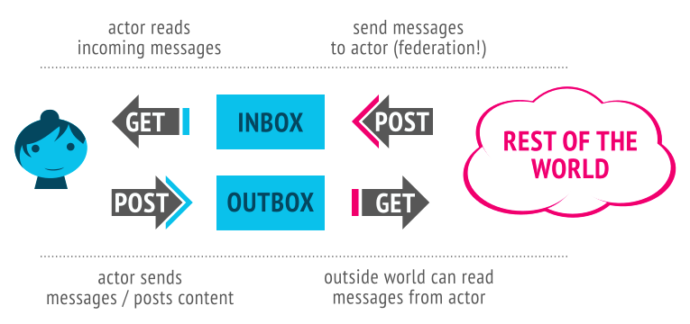
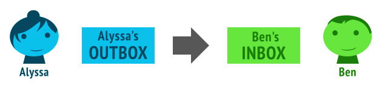
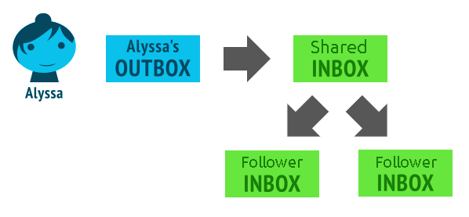

# ActivityPub Protocol Specification
## Abstract
The ActivityPub protocol is a decentralized social networking protocol based upon the [ActivityStreams 2.0](https://www.w3.org/TR/activitystreams-core) data format. It provides a client to server API for creating, updating and deleting content, as well as a federated server to server API for delivering notifications and content.

## Status of This Document
*This document is based upon the 2018 version of the [W3C ActivityPub specification](https://www.w3.org/TR/activitypub). Any alterations are for the purposes of more accurately reflecting the actual use of the protocol, with the aim of creating less confusion for new implementors.*

# 1. Overview
ActivityPub provides two layers:

 * **A server to server federation protocol** (so decentralized websites can share information)
 * **A client to server protocol** (so users, including real-world users, bots, and other automated processes, can communicate with ActivityPub using their accounts on servers, from a phone or desktop or web application or whatever)

ActivityPub implementations can implement just one of these things or both of them. However, once you've implemented one, it isn't too many steps to implement the other, and there are a lot of benefits to both (making your website part of the decentralized social web, and being able to use clients and client libraries that work across a wide variety of social websites).

In ActivityPub, a user is represented by "actors" via the user's accounts on servers, sometimes also called "instances". User's accounts on different servers correspond to different actors. Every Actor has:
 * **An `inbox`:** How they get messages from the world
 * **An `outbox`:** How they send messages to others


These are endpoints, or really, just URLs which are listed in the ActivityPub actor's ActivityStreams description. (More on [ActivityStreams](https://www.w3.org/TR/activitystreams-core) later).

Here's an example of the actor record of our friend Alyssa P. Hacker:

### Example 1
``` json
{
  "@context": [
    "https://www.w3.org/ns/activitystreams",
    "https://w3id.org/security/v1",
    {
      "Curve25519Key": "toot:Curve25519Key",
      "Device": "toot:Device",
      "Ed25519Key": "toot:Ed25519Key",
      "Ed25519Signature": "toot:Ed25519Signature",
      "EncryptedMessage": "toot:EncryptedMessage",
      "PropertyValue": "schema:PropertyValue",
      "alsoKnownAs": {"@id": "as:alsoKnownAs", "@type": "@id"},
      "cipherText": "toot:cipherText",
      "claim": {"@id": "toot:claim", "@type": "@id"},
      "deviceId": "toot:deviceId",
      "devices": {"@id": "toot:devices", "@type": "@id"},
      "discoverable": "toot:discoverable",
      "featured": {"@id": "toot:featured", "@type": "@id"},
      "featuredTags": {"@id": "toot:featuredTags", "@type": "@id"},
      "fingerprintKey": {"@id": "toot:fingerprintKey", "@type": "@id"},
      "focalPoint": {"@container": "@list", "@id": "toot:focalPoint"},
      "identityKey": {"@id": "toot:identityKey", "@type": "@id"},
      "manuallyApprovesFollowers": "as:manuallyApprovesFollowers",
      "messageFranking": "toot:messageFranking",
      "messageType": "toot:messageType",
      "movedTo": {"@id": "as:movedTo", "@type": "@id"},
      "publicKeyBase64": "toot:publicKeyBase64",
      "schema": "http://schema.org#",
      "suspended": "toot:suspended",
      "toot": "http://joinmastodon.org/ns#",
      "value": "schema:value"
    }
  ],
  "alsoKnownAs": ["https://activitypubhackers/users/Alyssa"],
  "attachment": [{"name": "XMPP",
                  "type": "PropertyValue",
                  "value": "alyssa@chatdomain"}],
  "devices": "https://instancedomain/users/Alyssa/collections/devices",
  "discoverable": True,
  "endpoints": {"sharedInbox": "https://instancedomain/inbox"},
  "featured": "https://instancedomain/users/Alyssa/collections/featured",
  "featuredTags": "https://instancedomain/users/Alyssa/collections/tags",
  "followers": "https://instancedomain/users/Alyssa/followers",
  "following": "https://instancedomain/users/Alyssa/following",
  "icon": {"mediaType": "image/png",
           "type": "Image",
           "url": "https://instancedomain/accounts/avatars/abc.png"},
  "id": "https://instancedomain/users/Alyssa",
  "image": {"mediaType": "image/jpeg",
            "type": "Image",
            "url": "https://instancedomain/accounts/headers/def.jpeg"},
  "inbox": "https://instancedomain/users/Alyssa/inbox",
  "manuallyApprovesFollowers": False,
  "name": "Alyssa",
  "outbox": "https://instancedomain/users/Alyssa/outbox",
  "preferredUsername": "Alyssa",
  "publicKey": {"id": "https://instancedomain/users/Alyssa#main-key",
                "owner": "https://instancedomain/users/Alyssa",
                "publicKeyPem": "-----BEGIN PUBLIC KEY-----\n"
                                "..."
                                "-----END PUBLIC KEY-----\n"},
  "published": "2016-03-16T00:00:00Z",
  "summary": "<p>Hacker in residence</p>",
  "tag": [],
  "type": "Person",
  "url": "https://instancedomain/@Alyssa"
}
```

ActivityPub uses [ActivityStreams](https://www.w3.org/TR/activitystreams-core) for its [vocabulary](https://www.w3.org/TR/activitystreams-vocabulary). This is pretty great because ActivityStreams includes all the common terms you need to represent all the activities and content flowing around a social network. It's likely that ActivityStreams already includes all the vocabulary you need, but even if it doesn't, ActivityStreams can be extended via [JSON-LD](https://en.wikipedia.org/wiki/JSON-LD). If you know what JSON-LD is, you can take advantage of the cool linked data approaches provided by JSON-LD. If you don't, don't worry, JSON-LD documents and ActivityStreams can be understood as plain old simple JSON. (If you're going to add extensions, that's the point at which JSON-LD really helps you out).

So, okay. Alyssa wants to talk to her friends, and her friends want to talk to her! Luckily these "inbox" and "outbox" things can help us out. They both behave differently for [GET and POST](https://www.w3schools.com/tags/ref_httpmethods.asp). Let's see how that works:



Hey nice, so just as a recap:

 * You can POST to someone's inbox to send them a message (server-to-server / federation only... this *is* federation!)
 * You can GET from your inbox to read your latest messages (client-to-server; this is like reading your social network stream)
 * You can POST to your outbox to send messages to the world (client-to-server)
 * You can GET from someone's outbox to see what messages they've posted (or at least the ones you're authorized to see). (client-to-server and/or server-to-server)

Of course, if that last one (GET'ing from someone's outbox) was the only way to see what people have sent, this wouldn't be a very efficient federation protocol! Indeed, federation happens usually by servers posting messages sent by actors to actors on other servers' inboxes.

Let's see an example! Let's say Alyssa wants to catch up with her friend, Ben Bitdiddle. She lent him a book recently and she wants to make sure he returns it to her. Here's the message she composes, as an [ActivityStreams](https://www.w3.org/TR/activitystreams-core) object:

### Example 2
``` json
{
  "@context": "https://www.w3.org/ns/activitystreams",
  "type": "Note",
  "to": ["https://chatty.example/users/ben"],
  "attributedTo": "https://instancedomain/users/alyssa",
  "published": "2039-10-15T10:30:11Z",
  "rejectReplies": False,
  "mediaType": "text/html",
  "attachment": [],
  "conversation": "3728447592750257207548",
  "summary": "Book",
  "content": "Say, did you finish reading that book I lent you?"
}
```

This is a note addressed to Ben. Since she doesn't want to distract him too much she includes a summary line, which is similar to an email subject line. She POSTs it to her outbox.


Since this is a non-activity object, the server recognizes that this is an object being newly created, and does the courtesy of wrapping it in a Create activity. (Activities sent around in ActivityPub generally follow the pattern of some activity by some actor being taken on some object. In this case the activity is a Create of a Note object, posted by a Person).

### Example 3
``` json
{
  "@context": "https://www.w3.org/ns/activitystreams",
  "type": "Create",
  "id": "https://instancedomain/users/alyssa/statuses/a29a6843/activity",
  "to": ["https://chatty.example/users/ben"],
  "actor": "https://instancedomain/users/alyssa",
  "object": {
    "type": "Note",
    "id": "https://instancedomain/users/alyssa/statuses/49e2d03d",
    "attributedTo": "https://instancedomain/users/alyssa",
    "to": ["https://chatty.example/users/ben"],
    "published": "2039-10-15T10:30:11Z",
    "rejectReplies": False,
    "mediaType": "text/html",
    "attachment": [],
    "conversation": "3728447592750257207548",
    "summary": "Book",
    "content": "Say, did you finish reading that book I lent you?"
  }
}
```

Alyssa's server looks up Ben's [ActivityStreams actor object](https://www.w3.org/TR/activitystreams-vocabulary/#actor-types), finds his inbox endpoint, and POSTs her object to his inbox.


Technically these are two separate steps... one is **client to server** communication, and one is **server to server** communication (federation). But, since we're using them both in this example, we can abstractly think of this as being a streamlined submission from outbox to inbox:



Cool! A while later, Alyssa checks what new messages she's gotten. Her phone polls her inbox via GET, and amongst a bunch of cat videos posted by friends and photos of her nephew posted by her sister, she sees the following:

### Example 4
``` json
{
  "@context": "https://www.w3.org/ns/activitystreams",
  "type": "Create",
  "id": "https://chatty.example/users/ben/statuses/51086/activity",
  "to": ["https://instancedomain/users/alyssa"],
  "actor": "https://chatty.example/users/ben",
  "object": {
    "type": "Note",
    "id": "https://chatty.example/users/ben/statuses/51085",
    "attributedTo": "https://chatty.example/users/ben",
    "to": ["https://instancedomain/users/alyssa"],
    "inReplyTo": "https://instancedomain/users/alyssa/statuses/49e2d03d",
    "published": "2039-10-15T12:45:45Z",
    "rejectReplies": False,
    "mediaType": "text/html",
    "conversation": "3728447592750257207548",
    "content": "<p>Argh, yeah, sorry, I'll get it back to you tomorrow.</p>
                <p>I was reviewing the section on register machines,
                since it's been a while since I wrote one.</p>"
  }
}
```

Here the *conversation* field is any unique identifier grouping the posts within this thread together. Hence even if some posts within a chain of replies are subsequently deleted the overall thread can still be obtained.

Alyssa is relieved, and likes Ben's post:

### Example 5
``` json
{
  "@context": "https://www.w3.org/ns/activitystreams",
  "type": "Like",
  "id": "https://instancedomain/users/alyssa/statuses/5312e10e",
  "to": ["https://chatty.example/users/ben"],
  "actor": "https://instancedomain/users/alyssa",
  "object": "https://chatty.example/users/ben/statuses/51086"
}
```

She POSTs this message to her outbox. (Since it's an activity, her server knows it doesn't need to wrap it in a Create object).

She reacts to Ben's post with an emoji.

### Example X
``` json
{
  "@context": "https://www.w3.org/ns/activitystreams",
  "type": "EmojiReact",
  "id": "https://instancedomain/users/alyssa/statuses/64832334",
  "to": ["https://chatty.example/users/ben"],
  "actor": "https://instancedomain/users/alyssa",
  "object": "https://chatty.example/users/ben/statuses/51086",
  "content": "📖"
}
```

And also POSTs the reaction message to her outbox.

Feeling happy about things, she decides to post a public message to her followers. Soon the following message is blasted to all the members of her followers collection, and since it has the special Public group addressed, is generally readable by anyone.

### Example 6
``` json
{
  "@context": "https://www.w3.org/ns/activitystreams",
  "type": "Create",
  "id": "https://instancedomain/users/alyssa/statuses/9282e9cc/activity",
  "to": ["https://instancedomain/users/alyssa/followers",
         "https://www.w3.org/ns/activitystreams#Public"],
  "actor": "https://instancedomain/users/alyssa",
  "object": {
    "type": "Note",
    "id": "https://instancedomain/users/alyssa/statuses/d18c55d4",
    "attributedTo": "https://instancedomain/users/alyssa",
    "to": ["https://instancedomain/users/alyssa/followers",
           "https://www.w3.org/ns/activitystreams#Public"],
    "published": "2039-10-15T13:11:16Z",
    "rejectReplies": False,
    "conversation": "57834623544792956335",
    "mediaType": "text/html",
    "content": "Lending books to friends is nice.  Getting them back is even nicer! :)"
  }
}
```

### 1.1 Social Web Working Group
ActivityPub is one of several related specifications being produced by the Social Web Working Group. Implementers interested in alternative approaches and complementary protocols should review Micropub and the overview document Social-Web-Protocols.

## 2. Conformance
As well as sections marked as non-normative, all authoring guidelines, diagrams, examples, and notes in this specification are non-normative. Everything else in this specification is normative.

The key words *MAY*, *MUST*, *MUST NOT*, *SHOULD*, and *SHOULD NOT* are to be interpreted as described in [RFC2119](https://datatracker.ietf.org/doc/html/rfc2119).

### 2.1 Specification Profiles
This specification defines two closely related and interacting protocols:

**A client to server protocol, or "Social API"**
This protocol permits a client to act *on behalf* of a user. For example, this protocol is used by a mobile phone or laptop application to interact with a social stream of the user's actor.

**A server to server protocol, or "Federation Protocol"**
This protocol is used to distribute activities between actors on different servers/instances, tying them into the same social graph.

The ActivityPub specification is designed so that once either of these protocols are implemented, supporting the other is of very little additional effort. However, servers may still implement one without the other. This gives three conformance classes:

**ActivityPub conformant Client**
This designation applies to any implementation of the entirety of the client portion of the client to server protocol.

**ActivityPub conformant Server/Instance**
This designation applies to any implementation of the entirety of the server portion of the client to server protocol.

**ActivityPub conformant Federated Server/Instance**
This designation applies to any implementation of the entirety of the federation protocols.

It is called out whenever a portion of the specification only applies to implementation of the federation protocol. In addition, whenever requirements are specified, it is called out whether they apply to the client or server (for the client-to-server protocol) or whether referring to a sending or receiving server in the server-to-server protocol.

## 3. Objects
Objects are the core concept around which both [ActivityStreams](https://www.w3.org/TR/activitystreams-core) and ActivityPub are built. Objects are often wrapped in Activities and are contained in streams of Collections, which are themselves subclasses of Objects. See the Activity-Vocabulary document, particularly the [Core Classes](https://www.w3.org/TR/activitystreams-vocabulary/#types); ActivityPub follows the mapping of this vocabulary very closely.

ActivityPub defines some terms in addition to those provided by [ActivityStreams](https://www.w3.org/TR/activitystreams-core). These terms are provided in the ActivityPub [JSON-LD context](http://www.w3.org/TR/json-ld/#the-context) at `https://www.w3.org/ns/activitystreams`. Implementers *SHOULD* include the ActivityPub context in their object definitions. Implementers *MAY* include additional context as appropriate.

ActivityPub shares the same [URI / IRI conventions as in ActivityStreams](https://www.w3.org/TR/activitystreams-core/#urls).

Servers *SHOULD* validate the content they receive to avoid content spoofing attacks. This *MAY* be done by checking the time that a server received a post at an `inbox` or `outbox` (converted to [UTC](https://en.wikipedia.org/wiki/Coordinated_Universal_Time)) against the `date` field within the [http header signature](https://datatracker.ietf.org/doc/html/draft-cavage-http-signatures-07), after the signature has been validated. If there is more than a few minutes difference then this could be a [replay attack](https://en.wikipedia.org/wiki/Replay_attack). See Security Considerations for details of using http signatures.

As an example, if example.com receives the activity

### Example 7
``` json
{
  "@context": "https://www.w3.org/ns/activitystreams",
  "type": "Like",
  "actor": "https://example.net/users/mallory",
  "to": ["https://hatchat.example/users/sarah",
         "https://example.com/users/john"],
  "object": {
    "@context": {"@language": "en"},
    "id": "https://example.org/users/alice/statuses/23",
    "type": "Note",
    "attributedTo": "https://example.org/users/alice",
    "mediaType": "text/html",
    "published": "2031-03-27T14:10:25Z",
    "conversation": "7342325925675729",
    "content": "I'm a goat"
  }
}
```

it should dereference the `id` both to ensure that it exists and is a valid object, and that it is not misrepresenting the object. (In this example, Mallory could be spoofing an object allegedly posted by Alice).

If a `published` or `updated` date appears within an object then it SHOULD be in [UTC](https://en.wikipedia.org/wiki/Coordinated_Universal_Time) format: **YYYY-MM-DDTHH:MM:SSZ**. This MAY be converted to local time for display within a user interface.

### 3.1 Object Identifiers
All Objects in [ActivityStreams](https://www.w3.org/TR/activitystreams-core) should have unique global identifiers. ActivityPub extends this requirement; all objects distributed by the ActivityPub protocol *MUST* have unique global identifiers, unless they are intentionally transient (short lived activities that are not intended to be able to be looked up, such as some kinds of chat messages or game notifications). These identifiers must fall into one of the following groups:

 * Publicly dereferencable URIs, such as HTTPS URIs, with their authority belonging to that of their originating server. (Publicly facing content *SHOULD* use HTTPS URIs if the network being used does not have integrated transport security).
 * An ID explicitly specified as the JSON `null` object, which implies an anonymous object (a part of its parent context)

Identifiers *MUST* be provided for activities posted in server to server communication, unless the activity is intentionally transient. However, for client to server communication, a server receiving an object posted to the outbox with no specified `id` *SHOULD* allocate an object ID in the actor's namespace and attach it to the posted object.

All objects have the following properties:

**id**
String value for the object's unique global identifier (unless the object is transient, in which case the `id` *MAY* be omitted.

**type**
String value for the type of the [object](https://www.w3.org/TR/activitystreams-core/#object).

### 3.2 Retrieving objects
The HTTP GET method may be dereferenced against an object's `id` property to retrieve the activity. Servers *MAY* use HTTP content negotiation as defined in [RFC7231](https://datatracker.ietf.org/doc/html/rfc7231) to select the type of data to return in response to a request, but *MUST* present the [ActivityStreams](https://www.w3.org/TR/activitystreams-core) object representation in response to `application/ld+json; profile="https://www.w3.org/ns/activitystreams"`, and *SHOULD* also present the [ActivityStreams](https://www.w3.org/TR/activitystreams-core) representation in response to `application/activity+json` as well. The client *MUST* specify an `Accept` header with the `application/ld+json; profile="https://www.w3.org/ns/activitystreams"` media type in order to retrieve the activity.

Servers *MAY* implement other behavior for requests which do not comply with the above requirement. (For example, servers may implement additional legacy protocols, or may use the same URI for both HTML and [ActivityStreams](https://www.w3.org/TR/activitystreams-core) representations of a resource).

Servers *MAY* require authorization as specified in section B.1 Authentication and Authorization, and may additionally implement their own authorization rules, such as **authorized fetch**. Servers *SHOULD* fail requests which do not pass their authorization checks with the appropriate [HTTP error code](https://en.wikipedia.org/wiki/List_of_HTTP_status_codes), or the **403 Forbidden** error code where the existence of the object is considered private. An origin server which does not wish to disclose the existence of a private target *MAY* instead respond with a status code of **404 Not Found**.

### 3.3 The source property
In addition to all the properties defined by the [Activity Vocabulary](https://www.w3.org/TR/activitystreams-vocabulary), ActivityPub extends the `Object` by supplying the `source` property. The `source` property is intended to convey some sort of source from which the `content` markup was derived, as a form of provenance, or to support future editing by clients. In general, clients do the conversion from `source` to `content`, not the other way around.

The value of `source` is itself an object which uses its own `content` and `mediaType` fields to supply source information.

### Example 8
``` json
{
  "@context": ["https://www.w3.org/ns/activitystreams",
               {"@language": "en"}],
  "type": "Note",
  "id": "http://postparty.example/users/username/statuses/2415",
  "conversation": "45327948756365",
  "mediaType": "text/html"
  "content": "<p>I <em>really</em> like strawberries!</p>",
  "source": {
    "content": "<p>I *really* like strawberries!</p>",
    "mediaType": "text/html"
  }
}
```

**Note: What to do when clients can't meaningfully handle a mediaType?**

In general, it's best to let a user edit their original post in the same source format they originally composed it in. But not all clients can reliably provide a nice interface for all source types, and since clients are expected to do the conversion from `source` to `content`, some clients may work with a media type that another client does not know how to work with. While a client could feasibly provide the `content` markup to be edited and ignore the source, this means that the user will lose the more desirable form of the original `source` in any future revisions. A client doing so should thus provide a minimally obtrusive warning cautioning that the original source format is not understood and is thus being ignored.

For example, Alyssa P. Hacker likes to post to her ActivityPub powered blog via an Emacs client she has written, leveraging [Org mode](http://orgmode.org). Later she switches to editing on her phone's client, which has no idea what `text/x-org` is or how to render it to HTML, so it provides a text box to edit the original `content` instead. A helpful warning displays above the edit area saying, "This was originally written in another markup language we don't know how to handle. If you edit, you'll lose your original source!" Alyssa decides the small typo fix isn't worth losing her nice org-mode markup and decides to make the update when she gets home.

### 3.4 Attachments

Attachments may be added to `Note` or `Article` objects. The `mediaType` can be any MIME type, and the attached media should be available at the specified `url`. The `attachment` list can include more than one item.

In the case of attached images, the `name` field can be used to supply a description.

### Example X
``` json
{
  "@context": "https://www.w3.org/ns/activitystreams",
  "type": "Create",
  "actor": "https://example.net/users/fearghus",
  "to": ["https://example.net/users/fearghus/followers",
         "https://www.w3.org/ns/activitystreams#Public"],
  "object": {
    "@context": {"@language": "en"},
    "id": "https://example.net/users/fearghus/statuses/6423726",
    "type": "Note",
    "attributedTo": "https://example.net/users/fearghus",
    "to": ["https://example.net/users/fearghus/followers",
           "https://www.w3.org/ns/activitystreams#Public"],
    "published": "2032-09-14T19:17:02Z",
    "summary": "",
    "sensitive": False,
    "conversation": "67243561372468724",
    "mediaType": "text/html",
    "content": "This is a post with an attached image",
    "attachment": [
    {
        "mediaType": "image/jpeg",
        "name": "Description of the attached image",
        "type": "Document",
        "url": "https://example.net/users/fearghus/media/hfr73473rgr283g.jpg"
    }
    ]
  }
}
```

It may also be necessary to warn about the content being attached. This can be done by setting `sensitive` to *True* and supplying a `summary` containing a warning message.

### 3.5 Hashtags

When a new post is created, if it has `content` containing one or more hashtags then these should be used to generate a list of `Hashtag` objects in a list called `tag`. The `href` for each tag in the list SHOULD refer to an [ActivityStreams collection](https://www.w3.org/TR/activitystreams-core/#collections) containing posts having that hashtag.

### Example X
``` json
{
  "@context": "https://www.w3.org/ns/activitystreams",
  "type": "Create",
  "actor": "https://example.net/users/fearghus",
  "to": ["https://example.net/users/fearghus/followers",
         "https://www.w3.org/ns/activitystreams#Public"],
  "object": {
    "@context": {"@language": "en"},
    "id": "https://example.net/users/fearghus/statuses/28265429",
    "type": "Note",
    "attributedTo": "https://example.net/users/fearghus",
    "to": ["https://example.net/users/fearghus/followers",
           "https://www.w3.org/ns/activitystreams#Public"],
    "published": "2032-05-29T15:08:47Z",
    "conversation": "5342890426429480",
    "mediaType": "text/html",
    "content": "Posting with <a href=\"https://example.net/tags/ActivityPub\" class=\"mention hashtag\" rel=\"tag\">#<span>ActivityPub</span></a>",
    "tag": [
    {
        "href": "https://example.net/tags/ActivityPub",
        "name": "#ActivityPub",
        "type": "Hashtag"
    }
    ]
  }
}
```
## 4. Actors
ActivityPub actors are generally one of the [ActivityStreams Actor Types](https://www.w3.org/TR/activitystreams-vocabulary/#actor-types), but they don't have to be. For example, a [Profile](https://www.w3.org/TR/activitystreams-vocabulary/#dfn-profile) object might be used as an actor, or a type from an [ActivityStreams](https://www.w3.org/TR/activitystreams-core) extension. Actors are retrieved like any other Object in ActivityPub. Like other [ActivityStreams objects](https://www.w3.org/TR/activitystreams-vocabulary/#object-types), actors have an `id`, which is a URI. When entered directly into a user interface (for example on a login form), it is desirable to support simplified naming. For this purpose, ID normalization *SHOULD* be performed as follows:

 * If the entered ID is a valid URI, then it is to be used directly.
 * If it appears that the user neglected to add a scheme for a URI that would otherwise be considered valid, such as `example.org/users/alice`, clients *MAY* attempt to provide a default scheme, preferably `https`.
 * Otherwise, the entered value should be considered invalid.

Once the actor's URI has been identified, it should be dereferenced.

### 4.1 Mapping "users" to Actors

ActivityPub does not dictate a specific relationship between "users" and Actors; many configurations are possible. There may be multiple human users or organizations controlling an Actor, or likewise one human or organization may control multiple Actors. Similarly, an Actor may represent a piece of software, like a bot, or an automated process. More detailed "user" modelling, for example linking together of Actors which are controlled by the same entity, or allowing one Actor to be presented through multiple alternate profiles or aspects, are at the discretion of the implementation.

### 4.2 Discovering Actor URLs

Actor URLs may be discovered via [webfinger (RFC7033)](https://datatracker.ietf.org/doc/html/rfc7033). The returned result from a webfinger request to a site owned by Alyssa might look like:

``` json
{'aliases': ['https://instancedomain/@Alyssa',
             'https://instancedomain/users/Alyssa'],
 'links': [{'href': 'https://instancedomain/@Alyssa',
            'rel': 'http://webfinger.net/rel/profile-page',
            'type': 'text/html'},
           {'href': 'https://instancedomain/users/Alyssa',
            'rel': 'self',
            'type': 'application/activity+json'},
           {'rel': 'http://ostatus.org/schema/1.0/subscribe',
            'template': 'https://instancedomain/authorize_interaction?uri={uri}'}],
 'subject': 'acct:Alyssa@instancedomain'}
```

This tells us if Alyssa has any aliases and `subject` tells us her ActivityPub account handle. We can use the `href` for the MIME type `application/activity+json` to locate Alyssa's actor at `https://instancedomain/users/Alyssa`, and then resolve it via making a json GET request with an `Accept` field having the same MIME type.

### 4.3 Actor objects

As the upstream vocabulary for ActivityPub, any applicable [ActivityStreams](https://www.w3.org/TR/activitystreams-core) property may be used on ActivityPub Actors. Some ActivityStreams properties are particularly worth highlighting to demonstrate how they are used in ActivityPub implementations.

Properties containing natural language values, such as `name`, `preferredUsername`, or `summary`, make use of [natural language support defined in ActivityStreams](https://www.w3.org/TR/activitystreams-core/#naturalLanguageValues).

#### 4.3.1 Actor objects *MUST* have, in addition to the properties mandated by section 3.1 Object Identifiers, the following properties:

##### inbox
A reference to an ActivityStreams [OrderedCollection](https://www.w3.org/TR/activitystreams-vocabulary/#dfn-orderedcollection) comprised of all the messages received by the actor; see section 5.2 Inbox.

##### outbox
An ActivityStreams [OrderedCollection](https://www.w3.org/TR/activitystreams-vocabulary/#dfn-orderedcollection) comprised of all the messages produced by the actor; see section 5.1 Outbox.

##### following
A link to an [ActivityStreams collection](https://www.w3.org/TR/activitystreams-core/#collections) of the actors that this actor is following; see section 5.4 Following Collection

##### followers
A link to an [ActivityStreams collection](https://www.w3.org/TR/activitystreams-core/#collections) of the actors that follow this actor; see section 5.3 Followers Collection.

##### publicKey
Describes the [http header signature](https://datatracker.ietf.org/doc/html/draft-cavage-http-signatures-07) public key for this account. This can be used by other accounts on the same or other federated servers to validate the authenticity of received posts.

##### preferredUsername
A short username which may be used to refer to the actor, with no uniqueness guarantees.

#### 4.3.2 Implementations *MAY* provide the following properties:

##### discoverable
Indicates whether the person wishes to be discoverable via recommendations or listings of active accounts.

##### liked
A link to an [ActivityStreams collection](https://www.w3.org/TR/activitystreams-core/#collections) of objects this actor has liked; see section 5.5 Liked Collection.

##### manuallyApprovesFollowers
If true then followers for this account require permission to be granted. This can be an effective anti-spam or anti-harassment feature.

##### published
This is a timestamp for when the account was first created, and is used to show a joined date on profile screens.

##### updated
A timestamp for when this actor was last changed. This can be used by followers to update their actor caches.

##### streams
A list of supplementary Collections which may be of interest.

##### endpoints
A json object which maps additional (typically server/domain-wide) endpoints which may be useful either for this actor or someone referencing this actor. This mapping may be nested inside the actor document as the value or may be a link to a JSON-LD document with these properties.

The `endpoints` mapping *MAY* include the following properties:

###### *proxyUrl*
Endpoint URI so this actor's clients may access remote ActivityStreams objects which require authentication to access. To use this endpoint, the client posts an `x-www-form-urlencoded` `id` parameter with the value being the `id` of the requested ActivityStreams object.

###### *oauthAuthorizationEndpoint*
If OAuth 2.0 bearer tokens [RFC6749](https://datatracker.ietf.org/doc/html/rfc6749) [RFC6750](https://datatracker.ietf.org/doc/html/rfc6750) are being used for authenticating client to server interactions, this endpoint specifies a URI at which a browser-authenticated user may obtain a new authorization grant.

###### *oauthTokenEndpoint*
If OAuth 2.0 bearer tokens [RFC6749](https://datatracker.ietf.org/doc/html/rfc6749) [RFC6750](https://datatracker.ietf.org/doc/html/rfc6750) are being used for authenticating client to server interactions, this endpoint specifies a URI at which a client may acquire an access token.

###### *provideClientKey*
If Linked Data Signatures and HTTP Signatures are being used for authentication and authorization, this endpoint specifies a URI at which browser-authenticated users may authorize a client's public key for client to server interactions.

###### *signClientKey*
If Linked Data Signatures and HTTP Signatures are being used for authentication and authorization, this endpoint specifies a URI at which a client key may be signed by the actor's key for a time window to act on behalf of the actor in interacting with foreign servers.

###### *sharedInbox*
An optional endpoint used for wide delivery of publicly addressed activities and activities sent to followers. `sharedInbox` endpoints *SHOULD* also be publicly readable `OrderedCollection` objects containing objects addressed to the Public special collection. Reading from the `sharedInbox` endpoint *MUST NOT* present objects which are not addressed to the `Public` endpoint.

##### url
A link to the actor's "profile web page", if not equal to the value of `id`.

##### name
The preferred "nickname" or "display name" of the actor.

##### summary
A quick summary or biography by the user about themselves.

##### featured
Link to an [ActivityStreams collection](https://www.w3.org/TR/activitystreams-core/#collections) containing "pinned" posts appearing on the account profile screen. Such posts are typically used to provide more information about the account, beyond the profile summary.

##### featuredTags
Link to an [ActivityStreams collection](https://www.w3.org/TR/activitystreams-core/#collections) containing tag objects representing hashtags. This is used to improve discoverability.

For example, Alyssa likes reading and so she pins a post containing hashtags for her favorite books to her profile. The post appears within the `featured` collection of her `actor` and the hashtags within the post appear within `featuredTags`. When searching the hashtag for a particular book, Misha discovers Alyssa's account and decides to send a follow request based upon their mutual interest.

##### icon
Describes an image which represents the user's profile picture (this may be a thumbnail).

##### image
Describes the profile page background banner for this person.

### Example 9
``` json
{
  "@context": [
    "https://www.w3.org/ns/activitystreams",
    "https://w3id.org/security/v1",
    {"@language": "ja"},
    {
      "Curve25519Key": "toot:Curve25519Key",
      "Device": "toot:Device",
      "Ed25519Key": "toot:Ed25519Key",
      "Ed25519Signature": "toot:Ed25519Signature",
      "EncryptedMessage": "toot:EncryptedMessage",
      "PropertyValue": "schema:PropertyValue",
      "alsoKnownAs": {"@id": "as:alsoKnownAs", "@type": "@id"},
      "cipherText": "toot:cipherText",
      "claim": {"@id": "toot:claim", "@type": "@id"},
      "deviceId": "toot:deviceId",
      "devices": {"@id": "toot:devices", "@type": "@id"},
      "discoverable": "toot:discoverable",
      "featured": {"@id": "toot:featured", "@type": "@id"},
      "featuredTags": {"@id": "toot:featuredTags", "@type": "@id"},
      "fingerprintKey": {"@id": "toot:fingerprintKey", "@type": "@id"},
      "focalPoint": {"@container": "@list", "@id": "toot:focalPoint"},
      "identityKey": {"@id": "toot:identityKey", "@type": "@id"},
      "manuallyApprovesFollowers": "as:manuallyApprovesFollowers",
      "messageFranking": "toot:messageFranking",
      "messageType": "toot:messageType",
      "movedTo": {"@id": "as:movedTo", "@type": "@id"},
      "publicKeyBase64": "toot:publicKeyBase64",
      "schema": "http://schema.org#",
      "suspended": "toot:suspended",
      "toot": "http://joinmastodon.org/ns#",
      "value": "schema:value"
    }
  ],
  "id": "https://kenzoishii.example.com/users/kenzoishii",
  "url": "https://kenzoishii.example.com/@kenzoishii"
  "following": "https://kenzoishii.example.com/users/kenzoishii/following",
  "followers": "https://kenzoishii.example.com/users/kenzoishii/followers",
  "featured": "https://kenzoishii.example.com/users/kenzoishii/featured",
  "featuredTags": "https://kenzoishii.example.com/users/kenzoishii/collections/tags",
  "liked": "https://kenzoishii.example.com/users/kenzoishii/liked",
  "inbox": "https://kenzoishii.example.com/users/kenzoishii/inbox",
  "outbox": "https://kenzoishii.example.com/users/kenzoishii/outbox",
  "endpoints": {"sharedInbox": "https://kenzoishii.example.com/inbox"},
  "preferredUsername": "kenzoishii",
  "name": "石井健蔵",
  "summary": "この方はただの例です",
  "published": "2017-08-23T00:00:00Z",
  "updated": "2022-02-09T00:00:00Z",
  "discoverable": True,
  "manuallyApprovesFollowers": False,
  "icon": {
    "mediaType": "image/png",
    "type": "Image",
    "url": "https://kenzoishii.example.com/accounts/avatars/730.png"
  },
  "image": {
    "mediaType": "image/jpeg",
    "type": "Image",
    "url": "https://kenzoishii.example.com/accounts/headers/zhw.jpg"
  },
  "publicKey": {"id": "https://kenzoishii.example.com/users/kenzoishii#main-key",
                "owner": "https://kenzoishii.example.com/users/kenzoishii",
                "publicKeyPem": "-----BEGIN PUBLIC KEY-----\n"
                                "..."
                                "-----END PUBLIC KEY-----\n"},
  "type": "Person"
}
```

## 5. Collections
ActivityStreams defines the collection concept; ActivityPub defines several collections with special behavior. Note that ActivityPub makes use of [ActivityStreams paging](https://www.w3.org/TR/activitystreams-core/#paging) to traverse large sets of objects.

Note that some of these collections are specified to be of type [`OrderedCollection`](https://www.w3.org/TR/activitystreams-vocabulary/#dfn-orderedcollection) specifically, while others are permitted to be either a [`Collection`](https://www.w3.org/TR/activitystreams-vocabulary/#dfn-collection) or an [`OrderedCollection`](https://www.w3.org/TR/activitystreams-vocabulary/#dfn-orderedcollection).

An [`OrderedCollection`](https://www.w3.org/TR/activitystreams-vocabulary/#dfn-orderedcollection) *MUST* be presented consistently in reverse chronological order.

**Note**

What property is used to determine the reverse chronological order is intentionally left as an implementation detail. For example, many SQL-style databases use an incrementing integer as an identifier, which can be reasonably used for handling insertion order in most cases. In other databases, an insertion time timestamp may be preferred. What is used isn't important, but the ordering of elements must remain intact, with newer items first. A property which changes regularly, such a "last updated" timestamp, should not be used.

### 5.1 Outbox
The outbox is discovered through the `outbox` property of an actor's profile. The `outbox` *MUST* be an [`OrderedCollection`](https://www.w3.org/TR/activitystreams-vocabulary/#dfn-orderedcollection).

The outbox stream contains activities the user has published, subject to the ability of the requestor to retrieve the activity (that is, the contents of the outbox are filtered by the permissions of the person reading it). If a user submits a request without Authorization the server should respond with all of the Public posts. This could potentially be all relevant objects published by the user, though the number of available items is left to the discretion of those implementing and deploying the server.

The outbox accepts HTTP POST requests, with behaviour described in Client to Server Interactions.

### 5.2 Inbox
The inbox is discovered through the `inbox` property of an actor's profile. The `inbox` *MUST* be an [`OrderedCollection`](https://www.w3.org/TR/activitystreams-vocabulary/#dfn-orderedcollection).

The inbox stream contains all activities received by the actor. The server *SHOULD* filter content according to the requester's permission. In general, the owner of an inbox is likely to be able to access all of their inbox contents. Depending on access control, some other content may be public, whereas other content may require authentication for non-owner users, if they can access the inbox at all.

The server *MUST* perform de-duplication of activities returned by the inbox. Duplication can occur if an activity is addressed both to an actor's followers, and a specific actor who also follows the recipient actor, and the server has failed to de-duplicate the recipients list. Such deduplication *MUST* be performed by comparing the `id` of the activities and dropping any activities already seen.

The inboxes of actors on federated servers accepts HTTP POST requests, with behaviour described in Delivery. Non-federated servers *SHOULD* return a 405 Method Not Allowed upon receipt of a POST request.

### 5.3 Followers Collection
Every actor *SHOULD* have a `followers` collection. This is a list of everyone who has sent a [Follow](https://www.w3.org/TR/activitystreams-vocabulary/#dfn-follow) activity for the actor, added as a side effect. This is where one would find a list of all the actors that are following the actor. The `followers` collection *MUST* be either an [`OrderedCollection`](https://www.w3.org/TR/activitystreams-vocabulary/#dfn-orderedcollection) or a [`Collection`](https://www.w3.org/TR/activitystreams-vocabulary/#dfn-collection) and *MAY* be filtered on privileges of an authenticated user or as appropriate when no authentication is given.

**Note: Default for notification targeting**

The follow activity generally is a request to see the objects an actor creates. This makes the Followers collection an appropriate default target for delivery of notifications.

### 5.4 Following Collection
Every actor *SHOULD* have a `following` collection. This is a list of everybody that the actor has followed, added as a side effect. The `following` collection *MUST* be either an [`OrderedCollection`](https://www.w3.org/TR/activitystreams-vocabulary/#dfn-orderedcollection) or a [`Collection`](https://www.w3.org/TR/activitystreams-vocabulary/#dfn-collection) and *MAY* be filtered on privileges of an authenticated user or as appropriate when no authentication is given.

### 5.5 Liked Collection
Every actor *MAY* have a `liked` collection. This is a list of every object from all of the actor's `Like` activities, added as a side effect. The `liked` collection *MUST* be either an [`OrderedCollection`](https://www.w3.org/TR/activitystreams-vocabulary/#dfn-orderedcollection) or a [`Collection`](https://www.w3.org/TR/activitystreams-vocabulary/#dfn-collection) and *MAY* be filtered on privileges of an authenticated user or as appropriate when no authentication is given.

###  5.6 Public Addressing
In addition to ActivityStreams collections and objects, Activities may additionally be addressed to the special "public" collection, with the identifier `https://www.w3.org/ns/activitystreams#Public`. For example:

### Example 10
``` json
{
  "@context": "https://www.w3.org/ns/activitystreams",
  "id": "https://www.w3.org/ns/activitystreams#Public",
  "type": "Collection"
}
```

Activities addressed to this special URI shall be accessible to all users, without authentication. Implementations *MUST NOT* deliver to the "public" special collection; it is not capable of receiving actual activities. However, actors *MAY* have a sharedInbox endpoint which is available for efficient shared delivery of public posts (as well as posts to followers-only; see section 7.1.3 Shared Inbox Delivery.

**Note**

Compacting an ActivityStreams object using the ActivityStreams JSON-LD context might result in `https://www.w3.org/ns/activitystreams#Public` being represented as simply `Public` or `as:Public` which are valid representations of the Public collection. Implementations which treat ActivityStreams objects as simply JSON rather than converting an incoming activity over to a local context using JSON-LD tooling should be aware of this and should be prepared to accept all three representations.

### 5.7 Likes Collection
Every object *MAY* have a `likes` collection. This is a list of all `Like` activities with this object as the `object` property, added as a side effect. The `likes` collection *MUST* be either an [`OrderedCollection`](https://www.w3.org/TR/activitystreams-vocabulary/#dfn-orderedcollection) or a [`Collection`](https://www.w3.org/TR/activitystreams-vocabulary/#dfn-collection) and *MAY* be filtered on privileges of an authenticated user or as appropriate when no authentication is given.

**Note**

Care should be taken to not confuse the the `likes` collection with the similarly named but different `liked` collection. In sum:

 * **liked:** Specifically a property of actors. This is a collection of `Like` activities performed *by the actor*, added to the collection as a side effect of delivery to the outbox.
 * **likes:** May be a property of any object. This is a collection of `Like` activities referencing this object, added to the collection as a side effect of delivery to the inbox.

### 5.8 Shares/Boosts Collection
Every object *MAY* have a `shares` collection, otherwise known as `boosts` or `repeats`. This is a list of all `Announce` activities with this object as the `object` property, added as a side effect. The `shares` collection *MUST* be either an [`OrderedCollection`](https://www.w3.org/TR/activitystreams-vocabulary/#dfn-orderedcollection) or a [`Collection`](https://www.w3.org/TR/activitystreams-vocabulary/#dfn-collection) and *MAY* be filtered on privileges of an authenticated user or as appropriate when no authentication is given.

### 5.9 Featured Collection
Every `actor` MAY have a `featured` collection, which contains "pinned" posts used to supply more information about the person or organization.

### 5.10 FeaturedTags Collection
Every `actor` MAY have a `featuredTags` collection to enhance discoverability, containing tag objects.

## 6. Client to Server Interactions
Activities as defined by ActivityStreams are the core mechanism for creating, modifying and sharing content within the social graph.

Client to server interaction takes place through clients posting Activities to an actor's outbox. To do this, clients *MUST* discover the URL of the actor's outbox from their profile and then *MUST* make an HTTP POST request to this URL with the Content-Type of `application/ld+json; profile="https://www.w3.org/ns/activitystreams"`. Servers *MAY* interpret a Content-Type or Accept header of `application/activity+json` as equivalent to `application/ld+json; profile="https://www.w3.org/ns/activitystreams"` for client-to-server interactions. The request *MUST* be authenticated with the credentials of the user to whom the outbox belongs. The body of the `POST` request *MUST* contain a single Activity (which *MAY* contain embedded objects), or a single non-Activity object which will be wrapped in a Create activity by the server.

### Example 11: Submitting an Activity to the Outbox
``` json
POST /outbox/ HTTP/1.1
Host: dustycloud.org
Authorization: Bearer XXXXXXXXXXX
Content-Type: application/ld+json; profile="https://www.w3.org/ns/activitystreams"

{
  "@context": ["https://www.w3.org/ns/activitystreams",
               {"@language": "en"}],
  "type": "Like",
  "actor": "https://dustycloud.org/users/chris",
  "name": "Chris liked 'Minimal ActivityPub update client'",
  "object": "https://rhiaro.co.uk/2016/05/minimal-activitypub",
  "to": ["https://rhiaro.co.uk/@amy",
         "https://dustycloud.org/users/chris/followers"],
  "cc": ["https://e14n.com/@evan"]
}
```
If an Activity is submitted with a value in the `id` property, servers *MUST* ignore this and generate a new `id` for the Activity. Servers *MUST* return a `201 Created` HTTP code, and unless the activity is transient, *MUST* include the new `id` in the `Location` header.

### Example 12: Outbox response to submitted Activity
``` http
HTTP/1.1 201 Created
Location: https://dustycloud.org/likes/345
```

The server *MUST* remove the `bto` and/or `bcc` properties, if they exist, from the ActivityStreams object before delivery, but *MUST* utilize the addressing originally stored on the `bto` / `bcc` properties for determining recipients in delivery.

The server *MUST* then add this new Activity to the outbox collection. Depending on the type of Activity, servers may then be required to carry out further side effects. (However, there is no guarantee that time the Activity may appear in the outbox. The Activity might appear after a delay or disappear at any period). These are described per individual Activity below.

Attempts to submit objects to servers not implementing client to server support *SHOULD* result in a `405 Method Not Allowed` response.

HTTP caching mechanisms [RFC7234](https://datatracker.ietf.org/doc/html/rfc7234) *SHOULD* be respected when appropriate, both in clients receiving responses from servers as well as servers sending responses to clients.

### 6.1 Client Addressing
**Clients** are responsible for addressing new Activities appropriately. To some extent, this is dependent upon the particular client implementation, but clients must be aware that the server will only forward new Activities to addressees in the `to`, `bto`, `cc`, `bcc`, and `audience` fields.

The Followers Collection and/or the Public Collection are good choices for the default addressing of new Activities.

Clients *SHOULD* look at any objects attached to the new Activity via the `object`, `target`, `inReplyTo` and/or `tag` fields, retrieve *their* `actor` or `attributedTo` properties, and *MAY* also retrieve their addressing properties, and add these to the `to` or `cc` fields of the new Activity being created. Clients *MAY* recurse through attached objects, but if doing so, *SHOULD* set a limit for this recursion. (Note that this does not suggest that the client should "unpack" collections of actors being addressed as individual recipients).

Clients *MAY* give the user the chance to amend this addressing in the UI.

For example, when Chris likes the following article by Amy:

### Example 13: An Article
``` json
{
  "@context": ["https://www.w3.org/ns/activitystreams",
               {"@language": "en-GB"}],
  "id": "https://rhiaro.co.uk/2016/05/minimal-activitypub",
  "type": "Article",
  "name": "Minimal ActivityPub update client",
  "content": "Today I finished morph, a client for posting ActivityStreams2...",
  "conversation": "1894367735757303",
  "attributedTo": "https://rhiaro.co.uk/@amy",
  "to": ["https://rhiaro.co.uk/followers"],
  "cc": ["https://e14n.com/@evan"]
}
```

the like is generated by the client as:

### Example 14: A Like of the Article
``` json
{
  "@context": ["https://www.w3.org/ns/activitystreams",
               {"@language": "en"}],
  "type": "Like",
  "actor": "https://dustycloud.org/users/chris",
  "summary": "Chris liked 'Minimal ActivityPub update client'",
  "object": "https://rhiaro.co.uk/2016/05/minimal-activitypub",
  "to": ["https://rhiaro.co.uk/@amy",
         "https://dustycloud.org/users/chris/followers"],
  "cc": ["https://e14n.com/@evan"]
}
```

The receiving outbox can then perform delivery to not only the followers of Chris (the liker), but also to Amy, and Amy's followers and Evan, both of whom received the original article.

Clients submitting the following activities to an `outbox` *MUST* provide the `object` property in the activity: `Create`, `Update`, `Delete`, `Follow`, `Add`, `Remove`, `Like`, `Block`, `Undo`. Additionally, clients submitting the following activities to an outbox *MUST* also provide the `target` property: `Add`, `Remove`.

### 6.2 Create Activity
The `Create` activity is used when posting a new object. This has the side effect that the object embedded within the Activity (in the `object` property) is created.

When a `Create` activity is posted, the `actor` of the activity *SHOULD* be copied onto the `object`'s `attributedTo` field.

A mismatch between addressing of the Create activity and its `object` is likely to lead to confusion. As such, a server *SHOULD* copy any recipients of the Create activity to its `object` upon initial distribution, and likewise with copying recipients from the `object` to the wrapping Create activity. Note that it is acceptable for the `object`'s addressing to be changed later without changing the `Create`'s addressing (for example via an `Update` activity).

#### 6.2.1 Object creation without a Create Activity
For client to server posting, it is possible to submit an object for creation without a surrounding activity. The server *MUST* accept a valid ActivityStreams object that isn't a subtype of `Activity` in the POST request to the outbox. The server then *MUST* attach this object as the `object` of a Create Activity. For non-transient objects, the server *MUST* attach an `id` to both the wrapping `Create` and its wrapped `Object`.

**Note**

The `Location` value returned by the server should be the URL of the new Create activity (rather than the object).

Any `to`, `bto`, `cc`, `bcc`, and `audience` properties specified on the object *MUST* be copied over to the new Create activity by the server.

### Example 15: Object with audience targeting
``` json
{
  "@context": "https://www.w3.org/ns/activitystreams",
  "type": "Note",
  "content": "This is a note",
  "published": "2015-02-10T15:04:55Z",
  "to": ["https://example.org/@john"],
  "cc": ["https://example.com/@erik/followers",
         "https://www.w3.org/ns/activitystreams#Public"]
}
```

The above example could be converted to this:

### Example 16: Create Activity wrapper generated by the server
``` json
{
  "@context": "https://www.w3.org/ns/activitystreams",
  "type": "Create",
  "id": "https://example.net/users/mallory/87374",
  "actor": "https://example.net/users/mallory",
  "object": {
    "id": "https://example.com/@mallory/statuses/72",
    "type": "Note",
    "attributedTo": "https://example.net/users/mallory",
    "conversation": "784365462623755",
    "content": "This is a note",
    "published": "2015-02-10T15:04:55Z",
    "to": ["https://example.org/@john"],
    "cc": ["https://example.com/@erik/followers",
           "https://www.w3.org/ns/activitystreams#Public"]
  },
  "published": "2015-02-10T15:04:55Z",
  "to": ["https://example.org/@john"],
  "cc": ["https://example.com/@erik/followers",
         "https://www.w3.org/ns/activitystreams#Public"]
}
```

### 6.3 Update Activity
The `Update` activity is used when updating an already existing object. The side effect of this is that the `object` *MUST* be modified to reflect the new structure as defined in the update activity, assuming the actor has permission to update this object.

### Example X
When Alan makes a change to his profile, his `actor` is sent out as an `update` activity POST to the `inbox` or `sharedInbox` of his followers.
``` json
{
  "@context": [
      "https://www.w3.org/ns/activitystreams",
      "https://enigmatic.social/schemas/litepub-0.1.jsonld",
      {"@language": "en"}
  ],
  "actor": "https://enigmatic.social/users/alan",
  "cc": [],
  "id": "https://enigmatic.social/activities/hiefuhfuoejwdwyscho",
  "object": {
    "alsoKnownAs": [],
    "attachment": [
      {
        "name": "Languages",
        "type": "PropertyValue",
        "value": "DE, EN"
      },
      {
        "name": "Website",
        "type": "PropertyValue",
        "value": "<a href=\"https://totally.enigmatic/\">https://totally.enigmatic/</a>"
      }
    ],
    "capabilities": {"acceptsChatMessages": true},
    "discoverable": false,
    "endpoints": {
      "oauthAuthorizationEndpoint": "https://enigmatic.social/oauth/authorize",
      "oauthRegistrationEndpoint": "https://enigmatic.social/api/v1/apps",
      "oauthTokenEndpoint": "https://enigmatic.social/oauth/token",
      "sharedInbox": "https://enigmatic.social/inbox",
      "uploadMedia": "https://enigmatic.social/api/ap/upload_media"
    },
    "featured": "https://enigmatic.social/users/alan/collections/featured",
    "followers": "https://enigmatic.social/users/alan/followers",
    "following": "https://enigmatic.social/users/alan/following",
    "icon": {
      "type": "Image",
      "url": "https://enigmatic.social/media/niefiwmwfyw.png"
    },
    "id": "https://enigmatic.social/users/alan",
    "image": {
      "type": "Image",
      "url": "https://enigmatic.social/media/jejfh4h38cmw.jpg"
    },
    "inbox": "https://enigmatic.social/users/alan/inbox",
    "manuallyApprovesFollowers": true,
    "name": "alan :alan_chess:",
    "outbox": "https://enigmatic.social/users/alan/outbox",
    "preferredUsername": "alan",
    "publicKey": {
      "id": "https://enigmatic.social/users/alan#main-key",
      "owner": "https://enigmatic.social/users/alan",
      "publicKeyPem": "-----BEGIN PUBLIC KEY-----\n
      ...
      -----END PUBLIC KEY-----\n\n"
    },
    "summary": "Chess player",
    "tag": [
      {
        "icon": {
          "type": "Image",
          "url": "https://enigmatic.social/emoji/custom/chess/alan_chess.png"
        },
        "id": "https://enigmatic.social/emoji/custom/chess/alan_chess.png",
        "name": ":alan_chess:",
        "type": "Emoji",
        "updated": "2022-05-11T00:00:00Z"
      }
    ],
    "type": "Person",
    "url": "https://enigmatic.social/users/alan"
  },
  "to": [
    "https://enigmatic.social/users/alan/followers",
    "https://www.w3.org/ns/activitystreams#Public"
  ],
  "type": "Update"
}
```

#### 6.3.1 Partial Updates
For client to server interactions, updates are partial; rather than updating the document all at once, any key value pair supplied is used to replace the existing value with the new value. This only applies to the top-level fields of the updated object. A special exception is for when the value is the json `null` type; this means that this field should be removed from the server's representation of the object.

Note that this behavior is for client to server interaction where the client is posting to the server only. Server to server interaction and updates from the server to the client should contain the entire new representation of the object, after the partial update application has been applied. See the description of the Update activity for server to server interactions for more details.

### 6.4 Delete Activity
The `Delete` activity is used to delete an already existing object. The side effect of this is that the server *MAY* replace the `object` with a `Tombstone` of the object that will be displayed in activities which reference the deleted object. If the deleted object is requested the server *SHOULD* respond with either the HTTP 410 Gone status code if a `Tombstone` object is presented as the response body, otherwise respond with a HTTP 404 Not Found.

The delete request, sent out by POST.
### Example X
``` json
{
  "@context": "https://www.w3.org/ns/activitystreams",
  "actor"': "https://example.com/users/alice",
  "object": "https://example.com/users/alice/statuses/72",
  "to": [
    "https://example.com/users/alice/followers",
    "https://www.w3.org/ns/activitystreams#Public"
  ],
  "cc"': [],
  "type": "Delete"
}
```

A deleted object:
### Example 17
``` json
{
  "@context": "https://www.w3.org/ns/activitystreams",
  "id": "https://example.com/@alice/statuses/72",
  "type": "Tombstone",
  "published": "2015-02-10T15:04:55Z",
  "updated": "2015-02-10T15:04:55Z",
  "deleted": "2015-02-10T15:04:55Z"
}
```

### 6.5 Follow Activity
The `Follow` activity is used to subscribe to the activities of another actor.

The side effect of receiving this in an **outbox** is that the server *SHOULD* add the `object` to the `actor`'s `following` Collection when and only if an `Accept` activity is subsequently received with this `Follow` activity as its object.

### Example X
Follow request sent by Misha to Alice.
``` json
{
  "@context": "https://www.w3.org/ns/activitystreams",
  "id": "https://anotherinstance/users/misha/statuses/67839359385539",
  "type": "Follow",
  "actor": "https://anotherinstance/users/misha",
  "object": "https://example.com/users/alice"
}
```

### 6.6 Add Activity
Upon receipt of an `Add` activity into the **outbox**, the server *SHOULD* add the `object` to the collection specified in the `target` property, unless:

 * the `target` is not owned by the receiving server, and thus they are not authorized to update it.
 * the `object` is not allowed to be added to the `target` collection for some other reason, at the receiving server's discretion.

### 6.7 Remove Activity
Upon receipt of a `Remove` activity into the **outbox**, the server *SHOULD* remove the `object` from the collection specified in the `target` property, unless:

 * the `target` is not owned by the receiving server, and thus they are not authorized to update it.
 * the `object` is not allowed to be removed from the `target` collection for some other reason, at the receiving server's discretion.

### 6.8 Like Activity
The `Like` activity indicates the `actor` likes the `object`.

The side effect of receiving this in an **outbox** is that the server *SHOULD* add the `object` to the `actor`'s `liked` Collection.

### 6.9 Block Activity
The `Block` activity is used to indicate that the posting actor does not want another actor (defined in the `object` property) to be able to interact with objects posted by the actor posting the `Block` activity. The server *SHOULD* prevent the blocked user from interacting with any object posted by the actor.

Servers *SHOULD NOT* deliver Block Activities to their `object`.

### 6.10 Undo Activity
The `Undo` activity is used to undo a previous activity. See the Activity Vocabulary documentation on [Inverse Activities and "Undo"](https://www.w3.org/TR/activitystreams-vocabulary/#inverse). For example, `Undo` may be used to undo a previous `Like`, `Follow`, or `Block`. The undo activity and the activity being undone *MUST* both have the same actor. Side effects should be undone, to the extent possible. For example, if undoing a `Like`, any counter that had been incremented previously should be decremented appropriately.

There are some exceptions where there is an existing and explicit "inverse activity" which should be used instead. `Create` based activities should instead use `Delete`, and `Add` activities should use `Remove`.

### 6.11 Delivery
Federated servers *MUST* perform delivery on all Activities posted to the **outbox** according to outbox delivery.

### 6.12 Uploading Media
*This section is non-normative.*

Servers *MAY* support uploading document types to be referenced in activites, such as images, video or other binary data, but the precise mechanism is out of scope for this version of ActivityPub. The Social Web Community Group is refining the protocol in the [ActivityPub Media Upload report](https://www.w3.org/wiki/SocialCG/ActivityPub/MediaUpload).

## 7. Server to Server Interactions
Servers communicate with other servers and propagate information across the social graph by posting activities to actors' inbox endpoints. An Activity sent over the network *SHOULD* have an `id`, unless it is intended to be transient (in which case it *MAY* omit the `id`).

**POST** requests (eg. to the inbox) *MUST* be made with a Content-Type of **application/ld+json; profile="https://www.w3.org/ns/activitystreams"** and `GET` requests (see also section 3.2 Retrieving objects) with an Accept header of **application/ld+json; profile="https://www.w3.org/ns/activitystreams"**. Servers *SHOULD* interpret a Content-Type or Accept header of **application/activity+json** as equivalent to **application/ld+json; profile="https://www.w3.org/ns/activitystreams"** for server-to-server interactions.

In order to propagate updates throughout the social graph, Activities are sent to the appropriate recipients. First, these recipients are determined through following the appropriate links between objects until you reach an actor, and then the Activity is inserted into the actor's *inbox* (delivery). This allows recipient servers to:

 * conduct any side effects related to the Activity (for example, notification that an actor has liked an object is used to update the object's like count);
 * deliver the Activity to recipients of the original object, to ensure updates are propagated to the whole social graph (see inbox delivery).

Delivery is usually triggered by, for example:

 * an Activity being created in an actor's outbox with their Followers Collection as the recipient.
 * an Activity being created in an actor's outbox with directly addressed recipients.
 * an Activity being created in an actor's outbox with user-curated collections as recipients.
 * an Activity being created in an actor's outbox or inbox which references another object.

Servers performing delivery to the `inbox` or `sharedInbox` properties of actors on other servers *MUST* provide the `object` property in the activity: `Create`, `Update`, `Delete`, `Follow`, `Add`, `Remove`, `Like`, `Block`, `Undo`. Additionally, servers performing server to server delivery of the following activities *MUST* also provide the `target` property: `Add`, `Remove`.

HTTP caching mechanisms [RFC7234](https://datatracker.ietf.org/doc/html/rfc7234) *SHOULD* be respected when appropriate, both when receiving responses from other servers as well as sending responses to other servers.

### 7.1 Delivery
*The following is required by federated servers communicating with other federated servers only.*

An activity is delivered to its targets (which are actors) by first looking up the targets' inboxes and then posting the activity to those inboxes. Targets for delivery are determined by checking the [ActivityStreams audience targeting](https://www.w3.org/TR/activitystreams-vocabulary/#audienceTargeting); namely, the `to`, `bto`, `cc`, `bcc`, and `audience` fields of the activity.

The inbox is determined by first retrieving the target actor's JSON-LD representation and then looking up the `inbox` property. If a recipient is a `Collection` or `OrderedCollection`, then the server *MUST* dereference the collection (with the user's credentials) and discover inboxes for each item in the collection. Servers *MUST* limit the number of layers of indirections through collections which will be performed, which *MAY* be one.

Servers *MUST* de-duplicate the final recipient list. Servers *MUST* also exclude actors from the list which are the same as the `actor` of the Activity being notified about. That is, actors shouldn't have their own activities delivered to themselves.

**Note: Silent and private activities**

What to do when there are no recipients specified is not defined, however it's recommended that if no recipients are specified the object remains completely private and access controls restrict the access to object. If the object is just sent to the "public" collection the object is not delivered to any actors but is publicly viewable in the actor's outbox.

An HTTP POST request (with authorization of the submitting user) is then made to the inbox, with the Activity as the body of the request. This Activity is added by the receiver as an `item` in the inbox OrderedCollection. Attempts to deliver to an inbox on a non-federated server *SHOULD* result in a `405 Method Not Allowed` response.

For federated servers performing delivery to a third party server, delivery *SHOULD* be performed asynchronously, and *SHOULD* additionally retry delivery to recipients if it fails due to network error.

**Note:** Activities being distributed between actors on the same origin may use any internal mechanism, and are not required to use HTTP.

**Note**: Relationship to Linked Data Notifications

While it is not required reading to understand this specification, it is worth noting that ActivityPub's targeting and delivery mechanism overlaps with the [Linked Data Notifications](https://www.w3.org/TR/ldn/) specification, and the two specifications may interoperably combined. In particular, the `inbox` property is the same between ActivityPub and Linked Data Notifications, and the targeting and delivery systems described in this document are supported by Linked Data Notifications. In addition to JSON-LD compacted ActivityStreams documents, Linked Data Notifications also supports a number of RDF serializations which are not required for ActivityPub implementations. However, ActivityPub implementations which wish to be more broadly compatible with Linked Data Notifications implementations may wish to support other RDF representations.

#### 7.1.1 Outbox Delivery Requirements for Server to Server
When objects are received in the outbox (for servers which support both Client to Server interactions and Server to Server Interactions), the server *MUST* target and deliver to:

 * The `to`, `bto`, `cc`, `bcc` or `audience` fields if their values are individuals or Collections owned by the actor.

These fields will have been populated appropriately by the client which posted the Activity to the outbox.

#### 7.1.2 Forwarding from Inbox
**Note**: Forwarding to avoid the ghost replies problem

The following section is to mitigate the "ghost replies" problem which occasionally causes problems on federated networks. This problem is best demonstrated with an example.

Alyssa makes a post about her having successfully presented a paper at a conference and sends it to her followers collection, which includes her friend Ben. Ben replies to Alyssa's message congratulating her and includes her followers collection on the recipients. However, Ben has no access to see the members of Alyssa's followers collection, so his server does not forward his messages to their inbox. Without the following mechanism, if Alyssa were then to reply to Ben, her followers would see Alyssa replying to Ben without having ever seen Ben interacting. This would be very confusing!

When Activities are received in the inbox, the server needs to forward these to recipients that the origin was unable to deliver them to. To do this, the server *MUST* target and deliver to the values of `to`, `cc`, and/or `audience` if and only if all of the following are true:

 * This is the first time the server has seen this Activity.
 * The values of `to`, `cc`, and/or `audience` contain a Collection owned by the server.
 * The values of `inReplyTo`, `object`, `target` and/or `tag` are objects owned by the server. The server *SHOULD* recurse through these values to look for linked objects owned by the server, and *SHOULD* set a maximum limit for recursion (ie. the point at which the thread is so deep the recipients followers may not mind if they are no longer getting updates that don't directly involve the recipient). The server *MUST* only target the values of `to`, `cc`, and/or `audience` on the original object being forwarded, and not pick up any new addressees whilst recursing through the linked objects (in case these addressees were purposefully amended by or via the client).

The server *MAY* filter its delivery targets according to implementation-specific rules (for example, spam filtering).

#### 7.1.3 Shared Inbox Delivery
For servers hosting many actors, delivery to all followers can result in an overwhelming number of messages sent. Some servers would also like to display a list of all messages posted publicly to the "known network". Thus ActivityPub provides an optional mechanism for serving these two use cases.

When an object is being delivered to the originating actor's followers, a server *MAY* reduce the number of receiving actors delivered to by identifying all followers which share the same sharedInbox who would otherwise be individual recipients and instead deliver objects to said `sharedInbox`. Thus in this scenario, the remote/receiving server participates in determining targeting and performing delivery to specific inboxes.



Additionally, if an object is addressed to the Public special collection, a server *MAY* deliver that object to all known `sharedInbox` endpoints on the network.

Origin servers sending publicly addressed activities to `sharedInbox` endpoints *MUST* still deliver to actors and collections otherwise addressed (through `to`, `bto`, `cc`, `bcc`, and `audience`) which do not have a `sharedInbox` and would not otherwise receive the activity through the `sharedInbox` mechanism.

### 7.2 Create Activity
Receiving a `Create` activity in an `inbox` has surprisingly few side effects; the activity should appear in the actor's `inbox` and it is likely that the server will want to locally store a representation of this activity and its accompanying object. However, this mostly happens in general with processing activities delivered to an `inbox` anyway.

### 7.3 Update Activity
For server to server interactions, an `Update` activity means that the receiving server *SHOULD* update its copy of the `object` of the same `id` to the copy supplied in the `Update` activity. Unlike the client to server handling of the Update activity, this is not a partial update but a complete replacement of the object.

The receiving server *MUST* take care to be sure that the `Update` is authorized to modify its `object`. At minimum, this may be done by ensuring that the `Update` and its `object` are of same origin.

### 7.4 Delete Activity
The side effect of receiving this is that (assuming the `object` is owned by the sending actor / server) the server receiving the delete activity *SHOULD* remove its representation of the `object` with the same `id`, and *MAY* replace that representation with a `Tombstone` object.

(Note that after an activity has been transmitted from an origin server to a remote server, there is nothing in the ActivityPub protocol that can *enforce* remote deletion of an object's representation).

### 7.5 Follow Activity
The side effect of receiving this in an **inbox** is that the server *SHOULD* generate either an `Accept` or `Reject` activity with the Follow as the `object` and deliver it to the `actor` of the Follow. The `Accept` or `Reject` *MAY* be generated automatically, or *MAY* be the result of user input (possibly after some delay in which the user reviews). Servers *MAY* choose to not explicitly send a `Reject` in response to a `Follow`, though implementors ought to be aware that the server sending the request could be left in an intermediate state. For example, a server might not send a `Reject` to protect a user's privacy.

In the case of receiving an `Accept` referencing this `Follow` as the object, the server *SHOULD* add the `actor` to the object actor's Followers Collection. In the case of a `Reject`, the server *MUST NOT* add the actor to the object actor's Followers Collection.

**Note**

Sometimes a successful `Follow` subscription may occur but at some future point delivery to the follower fails for an extended period of time. Implementations should be aware that there is no guarantee that actors on the network will remain reachable and should implement accordingly. For instance, if attempting to deliver to an actor for perhaps six months while the follower remains unreachable, it is reasonable that the delivering server remove the subscriber from the `followers` list. Timeframes and behavior for dealing with unreachable actors are left to the discretion of the delivering server.

### 7.6 Accept Activity
The side effect of receiving this in an **inbox** is determined by the type of the `object` received, and it is possible to accept types not described in this document (for example, an `Offer`).

If the `object` of an `Accept` received to an **inbox** is a `Follow` activity previously sent by the receiver, the server *SHOULD* add the `actor` to the receiver's Following Collection.

### Example X
Alice reviews Misha's follow request. Her account looks genuine, and not like a spammer. She accepts the follow, and it travels by POST back to Misha's `inbox`.
``` json
{
  "@context": "https://www.w3.org/ns/activitystreams",
  "type": "Accept",
  "actor": "https://example.com/users/alice",
  "to": ["https://anotherinstance/users/misha"],
  "cc": [],
  "object": {
    "@context": "https://www.w3.org/ns/activitystreams",
    "id": "https://anotherinstance/users/misha/statuses/67839359385539",
    "type": "Follow",
    "actor": "https://anotherinstance/users/misha",
    "object": "https://example.com/users/alice"
  }
}
```

### 7.7 Reject Activity
The side effect of receiving this in an **inbox** is determined by the type of the `object` received, and it is possible to reject types not described in this document (for example, an `Offer`).

If the `object` of a `Reject` received to an **inbox** is a `Follow` activity previously sent by the receiver, this means the recipient did not approve the `Follow` request. The server *MUST NOT* add the `actor` to the receiver's Following Collection.

### Example X
Alice reviews Mallory's follow request. It's from an unfamiliar instance, and the posts there look like spam. She rejects the request, which is then sent via POST to Mallory's `inbox`.
``` json
{
  "@context": "https://www.w3.org/ns/activitystreams",
  "type": "Reject",
  "actor": "https://example.com/users/alice",
  "to": ["https://unfamiliarinstance/users/mallory"],
  "cc": [],
  "object": {
    "@context": "https://www.w3.org/ns/activitystreams",
    "id": "https://unfamiliarinstance/users/mallory/statuses/7589238923642",
    "type": "Follow",
    "actor": "https://unfamiliarinstance/users/mallory",
    "object": "https://example.com/users/alice"
  }
}
```

### 7.8 Add Activity
Upon receipt of an `Add` activity into the **inbox**, the server *SHOULD* add the `object` to the collection specified in the `target` property, unless:

 * the `target` is not owned by the receiving server, and thus they can't update it.
 * the `object` is not allowed to be added to the `target` collection for some other reason, at the receiver's discretion.

### 7.9 Remove Activity
Upon receipt of a `Remove` activity into the **inbox**, the server *SHOULD* remove the `object` from the collection specified in the `target` property, unless:

 * the `target` is not owned by the receiving server, and thus they can't update it.
 * the `object` is not allowed to be removed to the `target` collection for some other reason, at the receiver's discretion.

### 7.10 Like Activity
The side effect of receiving this in an **inbox** is that the server *SHOULD* increment the object's count of likes by adding the received activity to the likes collection if this collection is present.

### 7.11 Announce Activity (sharing/boosting)
Upon receipt of an `Announce` activity in an **inbox**, a server *SHOULD* increment the object's count of shares by adding the received activity to the `shares` collection if this collection is present.

**Note**

The `Announce` activity is effectively what is known as "sharing", "reposting", or "boosting" in other social networks.

### Example X
Alice enjoys Misha's book review post. She boosts it so that her followers can also read it. The `object` field contains the `id` of Misha's post.
``` json
{
  "@context": "https://www.w3.org/ns/activitystreams",
  "actor": "https://example.com/users/alice",
  "cc": ["https://example.com/users/alice/followers"],
  "id": "https://example.com/users/alice/statuses/24389572539/activity",
  "object": "https://anotherinstance/users/misha/statuses/9254264627254",
  "published": "2022-10-07T11:04:48Z",
  "to": ["https://www.w3.org/ns/activitystreams#Public"],
  "type": "Announce"
}
```

### 7.12 Undo Activity
The `Undo` activity is used to undo the side effects of previous activities. See the ActivityStreams documentation on [Inverse Activities and "Undo"](https://www.w3.org/TR/activitystreams-vocabulary/#inverse). The scope and restrictions of the `Undo` activity are the same as for the Undo activity in the context of client to server interactions, but applied to a federated context.

## A. Internationalization
*This section is non-normative.*

Building an international base of users is important in a federated network. [ActivityStreams provides tooling for internationalization of content](https://www.w3.org/TR/activitystreams-core/#naturalLanguageValues), which should be used whenever possible. However, it can be difficult for implementations to determine which [`@language` property](https://www.w3.org/TR/activitystreams-core/#defaultlangcontext) to provide for user-submitted content. The [W3C Internationalization group](https://www.w3.org/International/) provides some [guidance on language detection](https://www.w3.org/International/wiki/LanguageDetection).

To support multiple languages, `Note` and `Article` objects can include `contentMap`, in addition to the `content` field. For Public notes this can help clients to display only posts which contain languages understood by the reader.

### Example X
``` json
{
  "@context": "https://www.w3.org/ns/activitystreams",
  "type": "Create",
  "id": "https://instancedomain/users/alyssa/statuses/63783815/activity",
  "to": ["https://instancedomain/users/alyssa/followers",
         "https://www.w3.org/ns/activitystreams#Public"],
  "actor": "https://instancedomain/users/alyssa",
  "object": {
    "type": "Note",
    "id": "https://instancedomain/users/alyssa/statuses/63783815",
    "attributedTo": "https://instancedomain/users/alyssa",
    "to": ["https://instancedomain/users/alyssa/followers",
           "https://www.w3.org/ns/activitystreams#Public"],
    "published": "2035-08-02T09:27:41Z",
    "rejectReplies": False,
    "mediaType": "text/html",
    "attachment": [],
    "summary": "",
    "content": "Nous construisons un web social décentralisé",
    "contentMap": {
        "fr": "Nous construisons un web social décentralisé"
    }
  }
}
```

## B. Security Considerations
*This section is non-normative.*

### B.1 Authentication and Authorization
ActivityPub uses authentication for two purposes; first, to authenticate clients to servers, and secondly in federated implementations to authenticate servers to each other.

The authentication method is not determined by this specification, but in most client to server implementations it happens via [OAuth 2.0](https://datatracker.ietf.org/doc/html/rfc6749). Other methods may be used.

Also see the [Social Web Community Group Authentication and Authorization best practices report](https://www.w3.org/wiki/SocialCG/ActivityPub/Authentication_Authorization).

### B.2 Verification
Servers should not trust client submitted content, and federated servers also should not trust content received from a server other than the content's origin without some form of verification.

Servers should be careful to verify that new content is really posted by the actor that claims to be posting it, and that the actor has permission to update the resources it claims to. See also section 3. Objects Authentication and Authorization.

#### B.2.1 HTTP Signature

Verification of incoming posts SHOULD occur via a `http header signature` check. Currently, [draft 07 of the http signatures RFC](https://datatracker.ietf.org/doc/html/draft-cavage-http-signatures-07) has become the *de facto* standard, although later versions MAY be implemented provided that sufficient support exists between federated servers.

A typical http signature created by Alyssa's server on an outgoing POST might look like the following:

``` http
Signature: keyId="https://instancedomain/users/alyssa#main-key",
           algorithm="rsa-sha256",
           headers="(request-target) host date digest content-type",
           signature="tsZYmLJTJJJ/U+...=="
```

http signatures SHOULD include `host`, `date` and a `digest` created from the post.

The receiving server can obtain Alyssa's public key from `https://instancedomain/users/alyssa#main-key` and use it to verify the signature.

#### B.2.2 Linked Data Signature

To allow for relaying of posts [linked data signatures](https://w3c-ccg.github.io/data-integrity-spec) MAY be used. This can allow posts to be verified as authentic even if they have passed through intermediate servers. An incoming post SHOULD be considered valid if its `http header signature` fails but an attached `linked data signature` passes.

### B.3 Accessing localhost URIs
It is often convenient while developing to test against a process running on localhost. However, permitting requests to localhost in a production client or server instance can be dangerous. Making requests to URIs on localhost which do not require authorization may unintentionally access or modify resources assumed to be protected to be usable by localhost-only.

If your ActivityPub server or client does permit making requests to localhost URIs for development purposes, consider making it a configuration option which defaults to off.

### B.4 URI Schemes
There are many types of URIs aside from just `http` and `https`. Some libraries which handle fetching requests at various URI schemes may try to be smart and reference schemes which may be undesirable, such as `file`. Client and server authors should carefully check how their libraries handle requests, and potentially whitelist only certain safe URI types, such as `http` and `https`.

### B.5 Recursive Objects
Servers should set a limit on how deep to recurse while resolving objects, or otherwise specially handle ActivityStreams objects with recursive references. Failure to properly do so may result in denial-of-service security vulnerabilities.

### B.6 Spam
Spam is a problem in any network, perhaps especially so in federated networks. While no specific mechanism for combating spam is provided in ActivityPub, it is recommended that servers filter incoming content both by local untrusted users and any remote users through some sort of spam filter.

### B.7 Federation denial-of-service
Servers should implement protections against denial-of-service attacks from other, federated servers. This can be done using, for example, some kind of ratelimiting mechanism. Servers should be especially careful to implement this protection around activities that involve side effects. Servers *SHOULD* also take care not to overload servers with submissions, for example by using an exponential backoff strategy.

### B.8 Client-to-server ratelimiting
Servers should ratelimit API client submissions. This serves two purposes:

 * It prevents malicious clients from conducting denial-of-service attacks on the server.
 * It ensures that the server will not distribute so many activities that it triggers another server's denial-of-service protections.

### B.9 Client-to-server response denial-of-service
In order to prevent a client from being overloaded by oversized Collections, servers should take care to limit the size of Collection pages they return to clients. Clients should still be prepared to limit the size of responses they are willing to handle in case they connect to malicious or compromised servers, for example by timing out and generating an error.

### B.10 Sanitizing Content
Any activity field being rendered for browsers (or other rich text enabled applications) should take care to sanitize fields containing markup to prevent cross site scripting attacks.

### B.11 Not displaying bto and bcc properties
`bto` and `bcc` already must be removed for delivery, but servers are free to decide how to represent the object in their own storage systems. However, since `bto` and `bcc` are only intended to be known/seen by the original author of the object/activity, servers should omit these properties during display as well.

## C. Acknowledgements
*This section is non-normative.*

This specification comes from years of hard work and experience by a number of communities exploring the space of federation on the web. In particular, much of this specification is informed by [OStatus](https://www.w3.org/community/ostatus/wiki/Main_Page) and the [Pump API](https://github.com/pump-io/pump.io/blob/master/API.md), as pioneered by StatusNet (now GNU Social) and Pump.io. Both of those initiatives were the product of many developers' hard work, but more than anyone, Evan Prodromou has been a constant leader in this space, and it is unlikely that ActivityPub would exist in something resembling its current state without his hard work.

Erin Shepherd built the initial version of this specification, borrowed from the ideas in the [Pump API](https://github.com/pump-io/pump.io/blob/master/API.md) document, mostly as a complete rewrite of text, but sharing most of the primary ideas while switching from ActivityStreams 1 to ActivityStreams 2.

Jessica Tallon and Christine Lemmer-Webber took over as editors when the standard moved to the W3C Social Working Group and did the majority of transition from Erin Shepherd's document to its current state as ActivityPub. Much of the document was rewritten and reorganized under the long feedback process of the Social Working Group.

ActivityPub has been shaped by the careful input of many members in the W3C Social Working Group. ActivityPub especially owes a great debt to Amy Guy, who has done more than anyone to map the ideas across the different Social Working Group documents through her work on Social-Web-Protocols. Amy also laid out the foundations for a significant refactoring of the ActivityPub spec while sprinting for four days with Christopher Allan Webber. These revisions lead to cleaner separation between the client to server and server components, along with clarity about ActivityPub's relationship to LDN, among many other improvements. Special thanks also goes to Benjamin Goering for putting together the implementation report template. We also thank mray for producing the spectacular tutorial illustrations (which are licensed under the same license as the rest of this document).

Many people also helped ActivityPub along through careful review. In particular, thanks to: Aaron Parecki, AJ Jordan, Benjamin Goering, Caleb Langeslag, Elsa Balderrama, elf Pavlik, Eugen Rochko, Erik Wilde, Jason Robinson, Manu Sporny, Michael Vogel, Mike Macgirvin, nightpool, Puck Meerburg, Sandro Hawke, Sarven Capadisli, Tantek Çelik, and Yuri Volkov.

This document is dedicated to all citizens of planet Earth. You deserve freedom of communication; we hope we have contributed in some part, however small, towards that goal and right.
